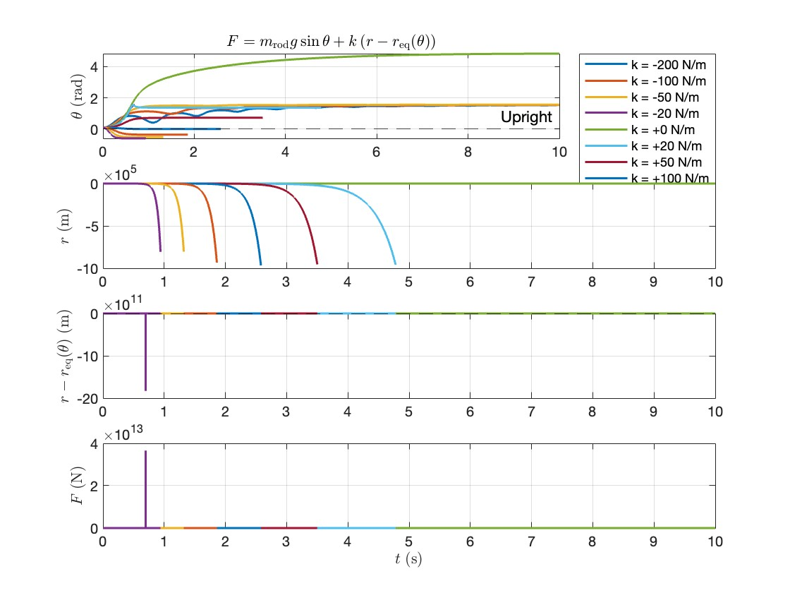
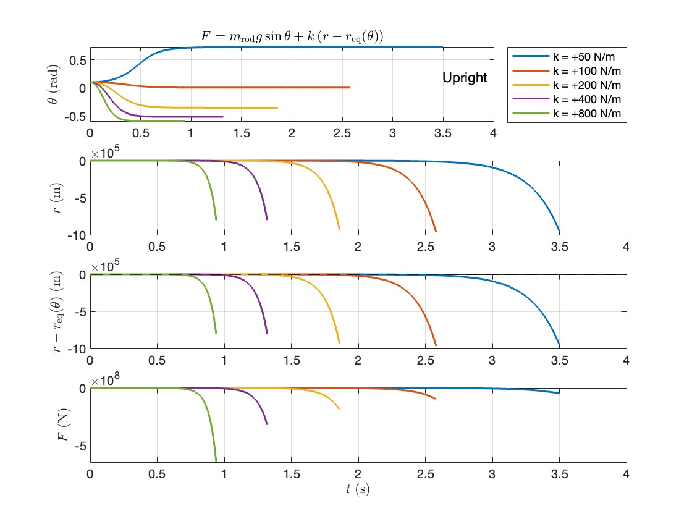
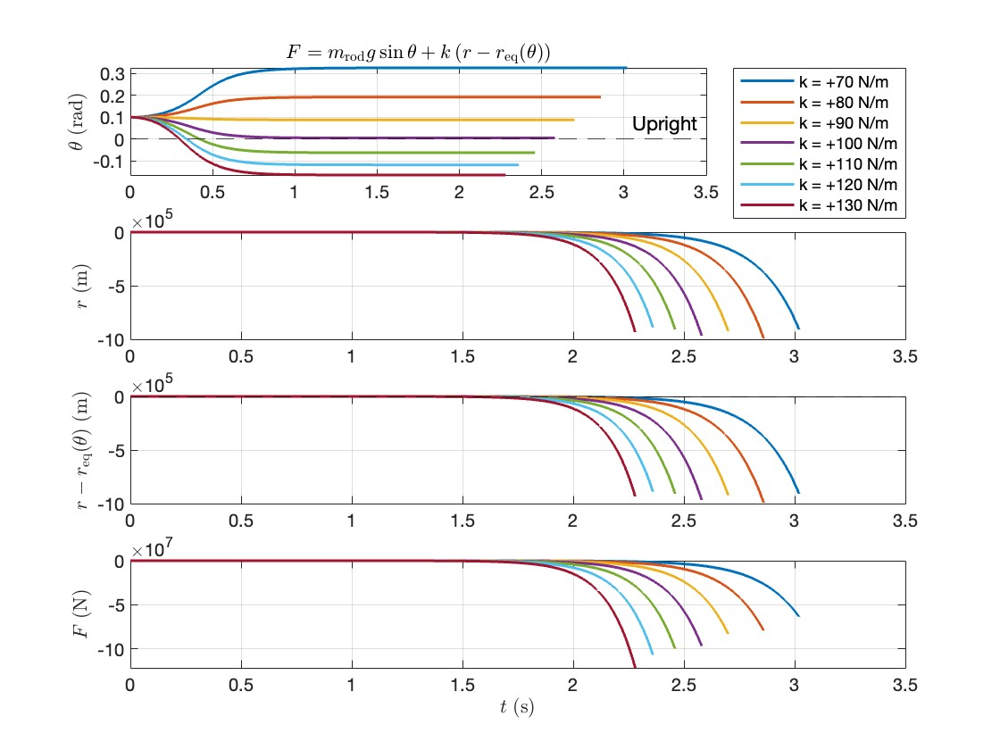
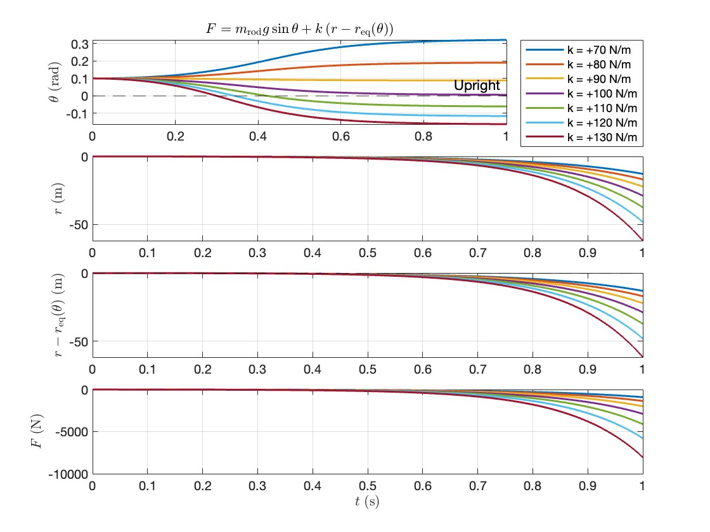
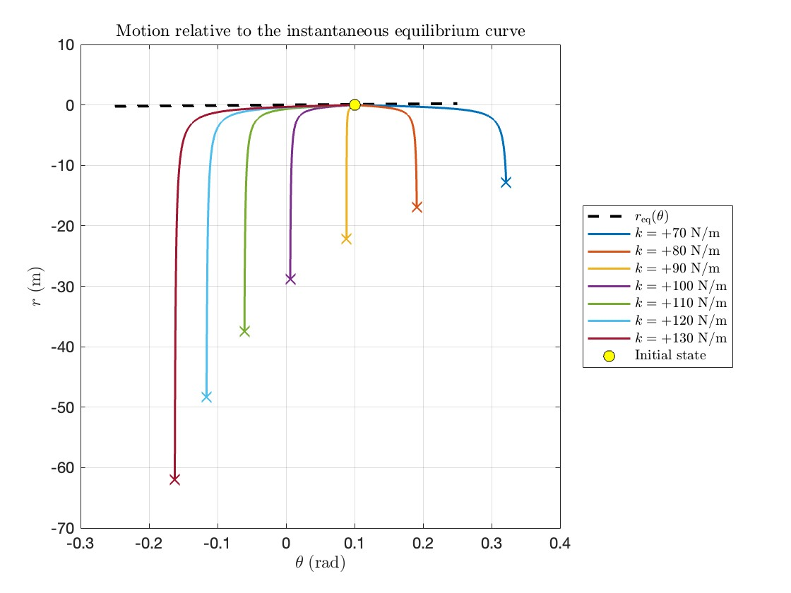
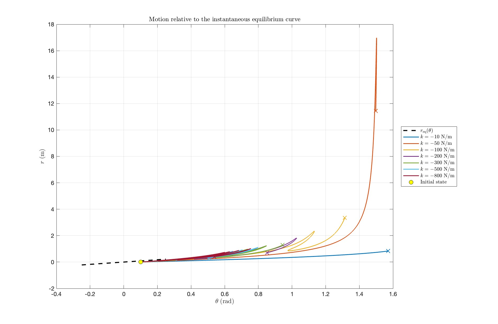
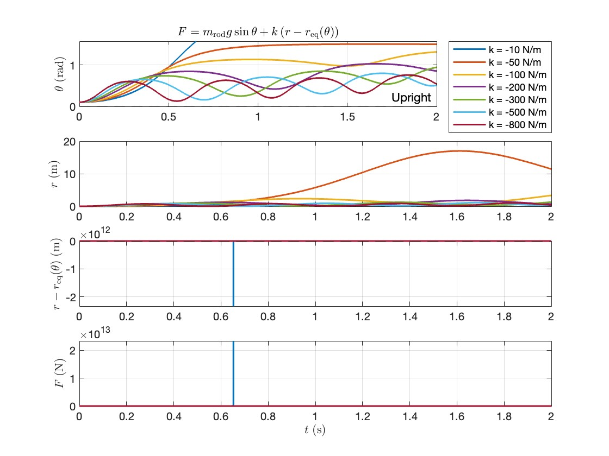

# Equilibrium Based Controller Design

## Controller Design

$$
F = m_{rod} g \sin\theta - k_1 (r-r_{des})
$$

Where 
$$
r_{des} = \frac{G + m_{rod} g R}{m_{rod} g} \tan\theta
= \frac{m_{p}g(R+h) + m_{w}gR + m_{rod} g R}{m_{rod} g} \tan\theta \\
= (\frac{m_{p}}{m_{rod}}(R+h) + \frac{m_{w}}{m_{rod}}R + R) \tan\theta
$$

Closer to $k > +50$ it seems to work better.

At around $k = 100$ it seems to work well.

At shorter timescales we can see the pattern:

 

### When K is negative

When $k < 0$ the system will try tokeep on the equilibrium line:

