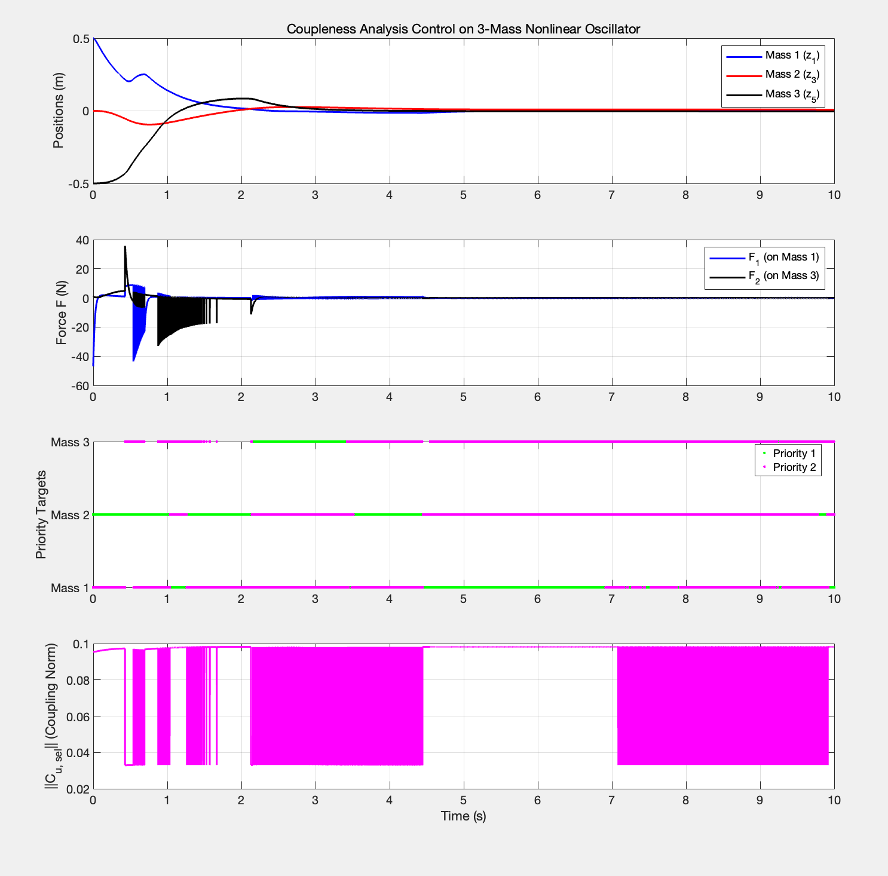

# Coupleness-Based Resource Scheduling Control vs. LQR

## 1. System Model Recapitulation
We are testing the controller on a benchmark **3-mass spring-damper system** with severe non-linearity (pure cubic springs) and under-actuation (3 degrees of freedom, 2 control inputs).

### State Vector
$$z = [z_1, z_2, z_3, z_4, z_5, z_6]^T$$
* $z_1, z_3, z_5$: Positions of Mass 1, 2, and 3.
* $z_2, z_4, z_6$: Velocities of Mass 1, 2, and 3.

### Nonlinear Spring Forces
The springs have **no linear stiffness component**, only pure cubic terms:
$$F_{spring1} = k_1 (z_1 - z_3)^3 + c_1 (z_2 - z_4)$$
$$F_{spring2} = k_2 (z_3 - z_5)^3 + c_2 (z_4 - z_6)$$

### State-Space Dynamics ($\dot{z} = f(z, F)$)
$$
\dot{z} = \begin{bmatrix}
z_2 \\
(-F_{spring1} + F_1) / m_1 \\
z_4 \\
(F_{spring1} - F_{spring2}) / m_2 \\
z_6 \\
(F_{spring2} + F_2) / m_3
\end{bmatrix}
$$
* *Note:* Mass 2 ($z_3, z_4$) is completely under-actuated; no direct control force is applied to it.

---

## 2. Key Finding: Why LQR Fails (Our Algorithm's Core Value)
When attempting to design a standard **Linear Quadratic Regulator (LQR)** as a baseline, MATLAB throws a fatal error: *"Unable to compute a stabilizing Riccati solution S."*

### The Mathematical Proof of LQR's Failure:
LQR requires a linearized plant $(A, B)$ at the origin ($z = 0$). If we derive the Jacobian of the cubic spring force with respect to relative displacement:
$$
\frac{\partial F_{spring}}{\partial (z_1 - z_3)} = 3k_1 (z_1 - z_3)^2
$$
Evaluating this at the equilibrium ($z = 0$) yields exactly **0**.

* **The "Blind Spot":** To the linearized model, the system at the origin appears to have **zero stiffness**. It looks like three isolated masses floating in space, connected only by dampers. 
* **Unstabilizable Modes:** The positional states end up as un-stabilizable modes on the imaginary axis. Therefore, the Riccati equation becomes unsolvable.

### Our Controller's Performance:

## 3. The Current Bottleneck: High-Frequency Chattering
While the position tracking looks promising (all three masses converge to zero within 3 seconds), a micro-view of the execution reveals a critical engineering flaw: **severe high-frequency chattering in the control inputs ($F_1, F_2$)**.