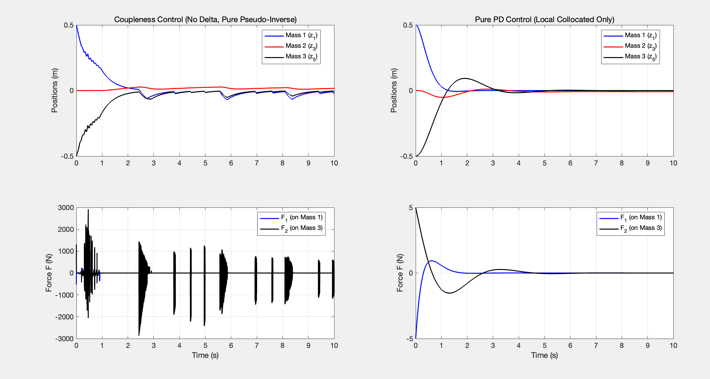

# Coupleness-Based Resource Scheduling Control vs. LQR: A Comparative Analysis

## 1. System Model Recapitulation
To validate the controller's efficacy, we benchmark it against a highly challenging **3-mass nonlinear oscillator**. The system is characterized by severe nonlinearity (pure cubic springs) and strict under-actuation (3 degrees of freedom, but only 2 control inputs).

**State Vector Definition:**
$$z = [z_1, z_2, z_3, z_4, z_5, z_6]^\top$$
* $z_1, z_3, z_5$: Positions of Mass 1, Mass 2, and Mass 3.
* $z_2, z_4, z_6$: Velocities of Mass 1, Mass 2, and Mass 3.

**Nonlinear Spring Dynamics:**
The springs possess **zero linear stiffness**, acting purely through cubic force displacement:
$$F_{spring1} = k_1 (z_1 - z_3)^3 + c_1 (z_2 - z_4)$$
$$F_{spring2} = k_2 (z_3 - z_5)^3 + c_2 (z_4 - z_6)$$

**State-Space Formulation:**
$$
\dot{z} = \begin{bmatrix}
z_2 \\
(-F_{spring1} + F_1) / m_1 \\
z_4 \\
(F_{spring1} - F_{spring2}) / m_2 \\
z_6 \\
(F_{spring2} + F_2) / m_3
\end{bmatrix}
$$
*Crucial Constraint:* Mass 2 ($z_3, z_4$) is completely under-actuated. It is dynamically shielded and can only be manipulated indirectly through the network topology.

---

## 2. The LQR Breakdown vs. Coupleness Efficacy
When attempting to synthesize a standard **Linear Quadratic Regulator (LQR)** as a baseline, the Riccati solver fails entirely: *"Unable to compute a stabilizing Riccati solution S."*

**The Mathematical Blind Spot of LQR:**
LQR relies on a linearized state-space $(A, B)$ evaluated at the equilibrium origin ($z = 0$). Taking the Jacobian of the pure cubic spring force with respect to relative displacement yields:
$$
\frac{\partial F_{spring}}{\partial (z_i - z_j)} = 3k_1 (z_i - z_j)^2
$$
Evaluating this gradient precisely at $z = 0$ results in exactly **0**. 

To the static linearized model, the system at the origin appears to have absolutely zero stiffness. It is perceived as three isolated floating masses connected only by dampers. The positional states of the under-actuated Mass 2 manifest as **un-stabilizable modes**, breaking the Riccati equation.

**The Coupleness Advantage:**
Our Coupleness-Based Controller does not rely on a static origin. By continuously re-evaluating the **Dynamic Coupleness Authority ($\mathcal{C}^u$)** across the state-dependent topology, the algorithm successfully "sees" the restoring forces generated as the masses deviate. As demonstrated in the results below, it reliably guides all three masses to zero within 3 seconds.

Also we could do this on a five mass system, and the result is kind of good:

---

## 3. Current Bottleneck: Actuation Chattering
While the state tracking performance (convergence within 3 seconds) validates the theoretical framework, a micro-analysis of the input signals reveals a practical engineering artifact: **high-frequency chattering in the control forces ($F_1, F_2$)**.

This phenomenon is a direct consequence of the **hard-switching resource scheduling logic**. When the coupling priorities (Score) of two masses oscillate around the same threshold in continuous time, the finite discrete time-step ($\Delta t$) forces the selection matrix $\mathcal{C}_{u, sel}$ to abruptly jump back and forth. Resolving this switching artifact is the immediate next step in refining the control law for physical implementation.