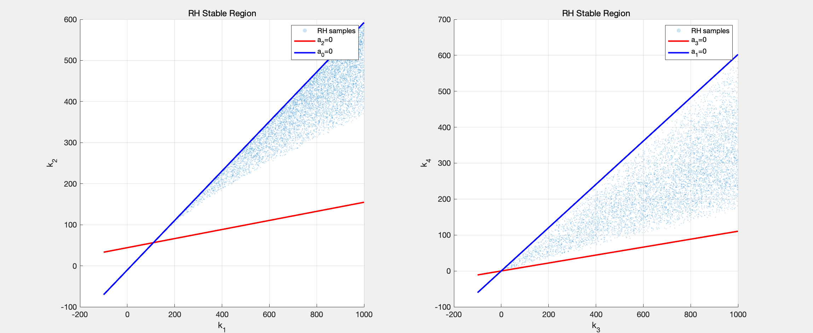

# Latitude Model Pole Placement analysis

The system moment of inertia $J_0$ is defined as follows:
$$J_0 = 2m_L R^2 + m_b (R+h)^2 + m_w R^2 + I_b + I_w + I_{rod}$$

Gravity coupling coefficients:
* $G_{\theta 1} = 2m_g R + m_g(R+h) + m_g R$
* $G_{r1} = 2m_g r$
* $G_{\theta 2} = 2m_g$

The system dynamics can be expressed in the form $N \ddot{q} = G q + F$, where $q = [\theta, r]^T$:

$$
N = \begin{bmatrix} 
J_0 & 2m_L R^2 \\ 
2m_L R^2 & 2m_L 
\end{bmatrix}
$$

$$
\begin{bmatrix} J_0 & 2m_L R^2 \\ 2m_L R^2 & 2m_L \end{bmatrix} \begin{bmatrix} \ddot{\theta} \\ \ddot{r} \end{bmatrix} = \begin{bmatrix} G_{\theta 1} & G_{r 1} \\ G_{\theta 2} & 0 \end{bmatrix} \begin{bmatrix} \theta \\ r \end{bmatrix} + \begin{bmatrix} 0 \\ F \end{bmatrix}
$$

Define the state vector $z = [\theta, r, \dot{\theta}, \dot{r}]^T$ and input $u = F$.

$$
\dot{z} = A z + B u
$$

Where:
$$
A = N^{-1} \begin{bmatrix} 0 & 0 & 1 & 0 \\ 0 & 0 & 0 & 1 \\ G_{\theta 1} & G_{r 1} & 0 & 0 \\ G_{\theta 2} & 0 & 0 & 0 \end{bmatrix}, \quad B = N^{-1} \begin{bmatrix} 0 \\ 0 \\ 0 \\ 1 \end{bmatrix}
$$

Through closed-loop feedback control $u = -Kz$, we place the closed-loop poles to satisfy the desired characteristic equation:
$$\det(\lambda I - (A - BK)) = 0$$

The continuing MATLAB code is in `MATLAB/analysis/PolePlacement.m`.

The result for the eigenvalues are:

$$
\lambda^4 + 0.5924 k_4 \lambda^3 - 0.06548 k_3 \lambda^3 + 0.5924 k_2 \lambda^2 - 0.06548 k_1 \lambda^2 - 26.2 \lambda^2 + 10.06 k_3 \lambda - 16.7 k_4 \lambda + 10.06 k_1 - 16.7 k_2 - 167.8 = 0
$$

To make it look better, we can rearrange the terms:

$$
\lambda^4 + (0.5924 k_4 - 0.06548 k_3) \lambda^3 + (0.5924 k_2 - 0.06548 k_1 - 26.2) \lambda^2 + (10.06 k_3 - 16.7 k_4) \lambda + (10.06 k_1 - 16.7 k_2 - 167.8) = 0
$$

## Some analysis on the characteristic equation

**For $k_1$ and $k_2$**

Apparently:

$$
10.06 k_1 - 16.7 k_2 - 167.8 > 0 \implies k_1 > 1.66 k_2 + 16.68
$$

From our usual assumptions that the the initial state is given by a small theta, we can get:

$$
\text{Maximum F of the motor} > k_1 \times \text{initial theta} \\
\implies k_1 < 27.6 N/ 5 \degree = 316.43 N/rad \\
\implies k_1 < 316.43 \text{ and } k_2 < (k_1 - 16.68) / 1.66 < 180.57
$$

**For More about Routh-Hurwitz criteria**

$$
a_3 = 0.5924 k_4 - 0.06548 k_3 \\
a_2 = 0.5924 k_2 - 0.06548 k_1 - 26.2 \\
a_1 = 10.06 k_3 - 16.7 k_4 \\
a_0 = 10.06 k_1 - 16.7 k_2 - 167.8
$$

We have used $a_0 > 0$ to get the constraint on $k_1$ and $k_2$. For $a_3 > 0$, we have:

$$
0.5924 k_4 - 0.06548 k_3 > 0 \implies k_4 > 0.1105 k_3
$$

For $a_2 > 0$, we have:

$$
0.5924 k_2 - 0.06548 k_1 - 26.2 > 0 \\
\implies k_2 > (0.06548 k_1 + 26.2) / 0.5924 \\
\implies k_2 > 0.1105 k_1 + 44.23
$$

For $a_1 > 0$, we have:

$$
10.06 k_3 - 16.7 k_4 > 0 \implies k_3 > 1.66 k_4
$$

This gives us the constraints on two triangular regions.

For $a_3 a_2 > a_1$, we have:

$$
(0.5924 k_4 - 0.06548 k_3)(0.5924 k_2 - 0.06548 k_1 - 26.2) > 10.06 k_3 - 16.7 k_4
$$

For $a_3 a_2 a_1 > a_1^2 + a_3^2 a_0$, we have:
$$
(0.5924 k_4 - 0.06548 k_3)(0.5924 k_2 - 0.06548 k_1 - 26.2)(10.06 k_3 - 16.7 k_4) > (10.06 k_3 - 16.7 k_4)^2 + (0.5924 k_4 - 0.06548 k_3)^2 (10.06 k_1 - 16.7 k_2 - 167.8)
$$

We can't really calculate the exact boundary, so we did a Monte Carlo sampling to find the feasible region that satisfies all the above inequalities. The result is shown below.

Given that the all the point inside the region satisfies the Routh-Hurwitz criteria, we can expect that the system is stable for all the points inside the region (after linearized). So now we can plug all this into the nonlinear model to further select the parameters that can stabilize the system in the nonlinear model. 

