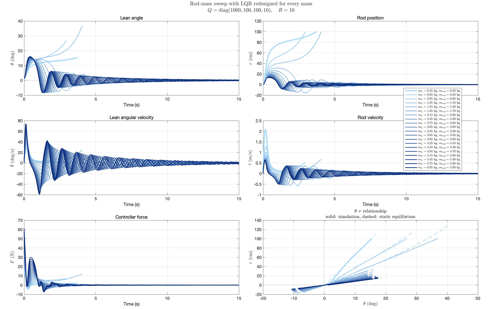
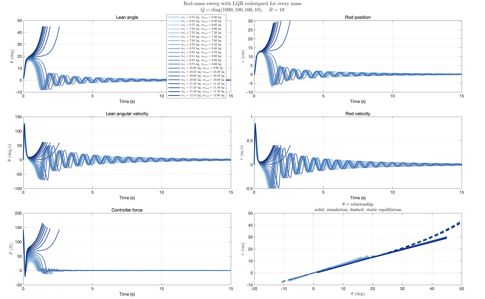
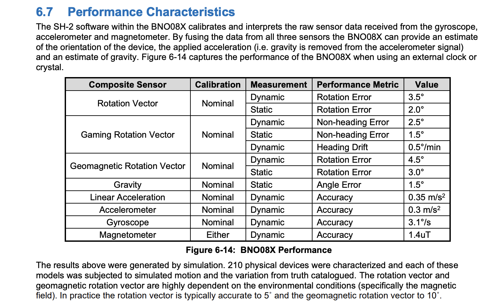

# Rod mass and IMU noise

## 1. Rod mass interference on the system

Previous I claimed that the $F\to \dot u_2 \to u_2 \to \theta$ strategy can't be replaced by a $F\to \dot \theta \to \theta$ strategy as long as $mR^2\ll J$. The following gives a proof of this claim.

$$
J = m_w R^2 + m_p (R + h)^2 + (I_w + I_b  + I_{rod}) \\
$$

We can get the boundary of mass attached:

$$
m_{extra} = 10.70 \text{ kg}
$$

Given an LQR gain $L = \begin{bmatrix} 1000 & 100 & 100 & 10 \end{bmatrix}， R = 10$, we adjust the mass of the rod:

At $[0.20 : 6.00]$ kg, $1.2\degree$ of initial condition:

We can see smaller response time and closer to the zero axis.

With higher weight:

With larger weight, we can see that there is a boundary where the system actually becomes less controllable, which is about $m_{extra} = 4 \text{ kg}$.

## 2. Adding IMU noise to the system

According to the document:

Matlab code `withnoise.m`

## 3. Equilibrium surface analysis

Matlab code `equilibrium_curve_lqr_3d.m`

## 4. Eigenvalue analysis

[Doc](../ControllerDesign/closed_loop_eigenanalysis_theta_r_u1_u2.md)