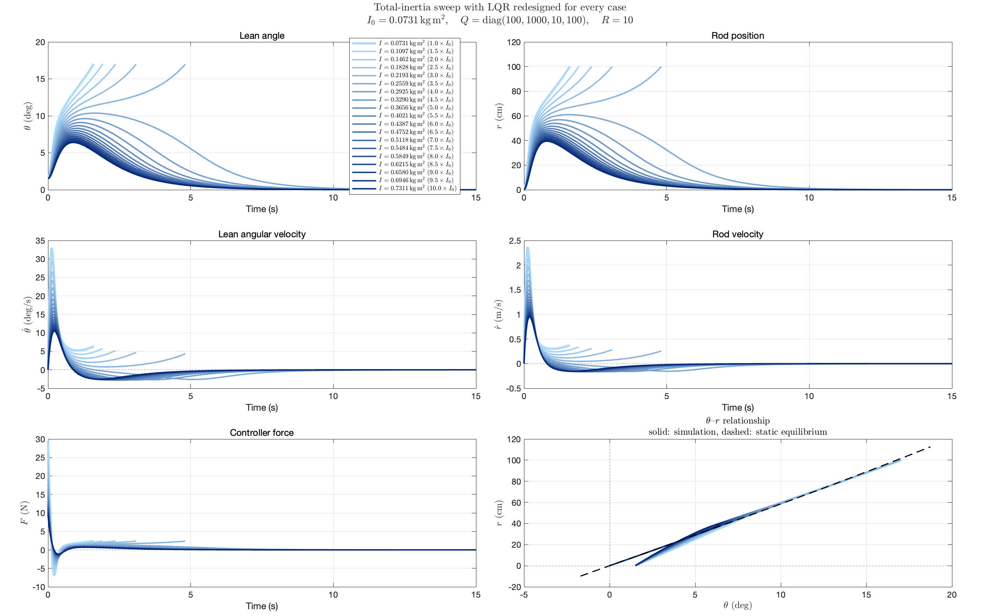
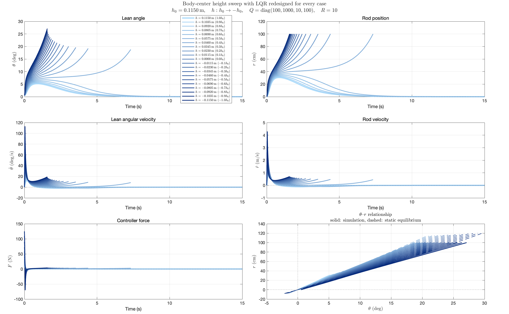
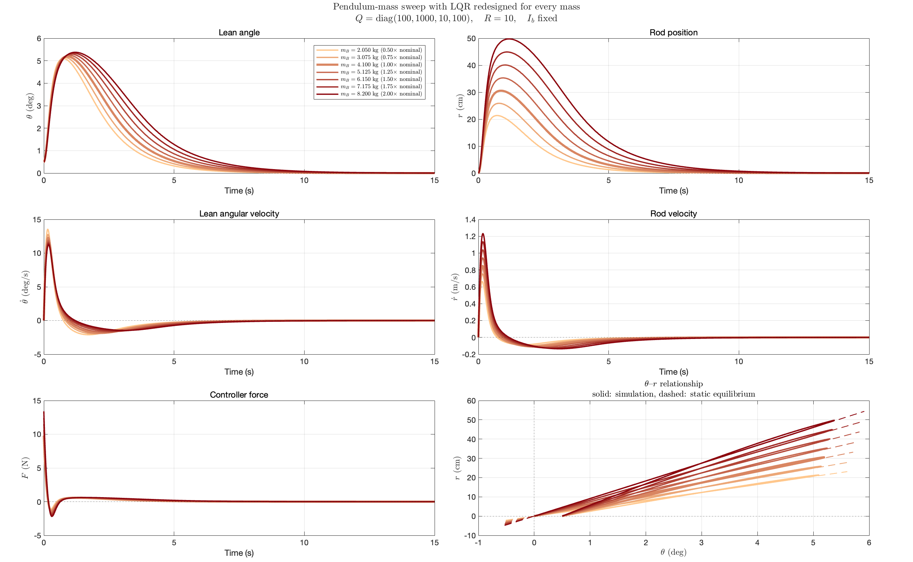

# System parameter effect on controllability

[TOC]

$$
\begin{bmatrix} 
m_w R^2 + m_{rod} r^2 + m_p (R + h)^2 + (I_w + I_b  + I_{rod}) & 0 \\ 
0 & m_{rod} 
\end{bmatrix}
\begin{bmatrix} 
\dot{u}_1 \\ 
\dot{u}_2 
\end{bmatrix}
= \begin{bmatrix} 
F R - m_{rod} g r \cos\theta + m_w g R \sin\theta + m_p g (R + h) \sin\theta - m_{rod} r (2 u_2 u_1 + R u_1^2) \\ 
F - m_{rod} g \sin\theta + m_{rod} r u_1^2 
\end{bmatrix}
$$

## 1. Inertia terms

By inertia terms, we acutally means all the terms in the upper-left 2x2 mass matrix, which involves the following parameters:

$$
m_w R^2 + m_{rod} r^2 + m_p (R + h)^2 + (I_w + I_b  + I_{rod})
$$

To estimate the pure effect of inertia terms, we will only change $I = I_w + I_b  + I_{rod}$, and keep all the other parameters fixed. Under current parameter setting, we have: $I \approx 0.07 \text{ kg}\cdot\text{m}^2$

($1.5 \degree$ initial condition)

## 2. Pendulum position

If pendulum is in the lower position, we suspect that the system could be more controllable.

But in fact, the system is less controllable when pendulum is in the lower position.

Also pendulum mass:

## 3. Weight of the mass, according to the essay

We can check whether the param setting in the essay are more tolerable to the IMU noise.

From the essay we can get:

$$
m_w = 4 \text{ kg}, \quad m_{rod} = 10 \text{ kg}, \quad m_p = 10 \text{ kg}, h = R = 0.3 \text{m}
$$

## 4. Linearization along the equilibrium curve

