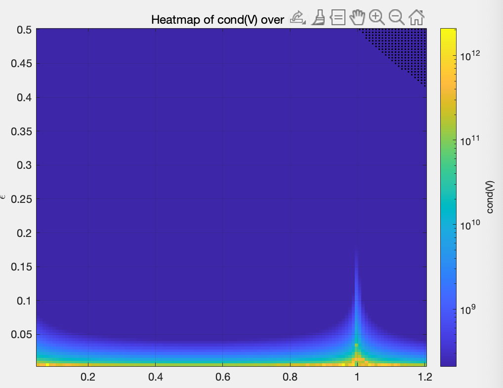
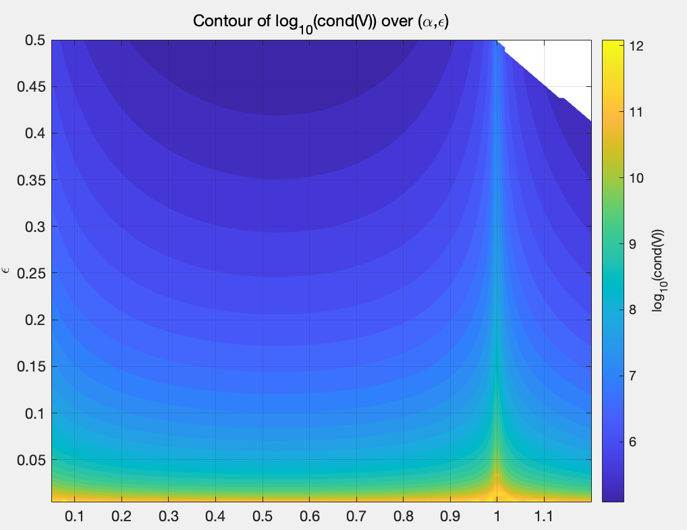

# Eigenvector Analysis

According to the previous Monte Carlo pole-placement analysis, the feasible pole locations satisfying the force and displacement constraints at an initial lean angle of (\theta_0=0.1^\circ) approximately lie within the following region:

$$
\begin{aligned}
\lambda_1+\lambda_2 &\approx -3,\\
\lambda_3+\lambda_4 &\approx -3,\\
\lambda_i &\in [-2.25,-1.25],
\qquad i=1,2,3,4.
\end{aligned}
$$

Here, (\lambda_i) denotes a closed-loop eigenvalue. Near the midpoint of this feasible boundary, the following desired poles are selected:

$$
\lambda_1=-1.73,\qquad
\lambda_2=-1.74,\qquad
\lambda_3=-1.75,\qquad
\lambda_4=-1.76.
$$

For the closed-loop matrix

$$
A_{\mathrm{cl}}=A-BK,
$$

the corresponding eigenvector obtained from MATLAB is

$$
\begin{aligned}
v_1&= \begin{bmatrix}
0.1486\\
0.4779\\
-0.2571\\
-0.8267
\end{bmatrix},
v_2&= \begin{bmatrix}
0.1481\\
0.4758\\
-0.2576\\
-0.8279 
\end{bmatrix},
v_3&=
\begin{bmatrix}
-0.1475\\
-0.4737\\
0.2581\\
0.8290
\end{bmatrix},
&
v_4&=
\begin{bmatrix}
0.1469\\
0.4717\\
-0.2585\\
-0.8301
\end{bmatrix}.
\end{aligned}
$$

The state ordering used in the linear model is

$$
x=
\begin{bmatrix}
\theta & r & \dot \theta &  \dot r
\end{bmatrix}^{\top}
$$

To compare the modal directions, each eigenvector is normalized such that its (\theta) component is equal to one:

$$
\begin{aligned}
\bar v_1
&=\frac{v_1}{0.1486}
\approx
\begin{bmatrix}
1\\
3.2160\\
-1.7301\\
-5.5633
\end{bmatrix},
\bar v_2
&=\frac{v_2}{0.1481}
\approx
\begin{bmatrix}
1\\
3.2127\\
-1.7394\\
-5.5901
\end{bmatrix},
\bar v_3
&=\frac{v_3}{-0.1475}
\approx
\begin{bmatrix}
1\\
3.2115\\
-1.7498\\
-5.6203
\end{bmatrix},
\bar v_4
&=\frac{v_4}{0.1469}
\approx
\begin{bmatrix}
1\\
3.2110\\
-1.7597\\
-5.6508
\end{bmatrix}.
\end{aligned}
$$

The velocity components satisfy approximately

$$
v_{\dot\theta,i}=\lambda_i v_{\theta,i},
\qquad
v_{\dot r,i}=\lambda_i v_{r,i},
$$

which is expected from the position–velocity structure of the state-space model.

The four normalized eigenvectors are almost parallel. Their configuration components approximately satisfy

$$
\begin{bmatrix}
\theta\\
r
\end{bmatrix}
\propto
\begin{bmatrix}
1\\
3.21
\end{bmatrix}.
$$

Thus, all four closed-loop modes represent nearly the same coupled motion between the lean angle and the movable-mass displacement. The different eigenvalues mainly produce slightly different decay rates rather than clearly separated physical modal directions.

This behavior results from placing all four poles within a very narrow interval:

$$
\lambda_i\in[-1.76,-1.73].
$$

Because the eigenvectors are nearly parallel, the eigenvector matrix (V) is poorly conditioned. Using the displayed rounded values gives approximately

$$
\operatorname{cond}(V)\approx 6.4\times10^4.
$$

A large condition number indicates that the closed-loop system is highly non-normal and close to having repeated, defective modes. Although all eigenvalues are negative and therefore guarantee asymptotic stability for the linear model, the system may still exhibit strong sensitivity to initial conditions, model uncertainty, numerical perturbations, and actuator saturation.

Consequently, tightly clustering all poles near (-1.75) may produce satisfactory nominal eigenvalues but poor modal robustness. For the next steps I will explore different combintions of poles.

**Evaluate whether the parallel eigenvectors are a result of clustering the ploes.**

To keep the shape of the eigenvalues and evaluate the effect of clustering, define:

$$
\begin{aligned}
\lambda_1&=-1.75 - \epsilon,\\
\lambda_2&=-1.75 + \epsilon,\\
\lambda_3&=-1.75 - \alpha\epsilon,\\
\lambda_4&=-1.75 + \alpha\epsilon,
\end{aligned}
$$

And with adjusting the parameters $(\alpha, \epsilon)$ to see how the eigenvectors change. To give a measure for the parallelism of the eigenvectors, I will use the condition number of the eigenvector matrix $V$ as a measure of parallelism. The condition number is defined as:

$$
\operatorname{cond}(V) = \frac{\sigma_{\max}(V)}{\sigma_{\min}(V)},
$$
where $\sigma_{\max}(V)$ and $\sigma_{\min}(V)$ are the maximum and minimum singular values of the eigenvector matrix $V$, respectively. A high condition number indicates that the eigenvectors are nearly parallel, while a low condition number indicates that they are more orthogonal.

To make the result clearer, we can take a logarithm of the condition number.

From here we can see that when $\alpha = 0.5, \epsilon = 0.5$

At this point, the poles are $[-1.75 - 0.5, -1.75 + 0.5, -1.75 - 0.25, -1.75 + 0.25] = [-2.25, -1.25, -2.00, -1.50]$

Plugging back, the maximum initial theta angle allowed is $0.117\degree$ and maximum $r$ is $0.25m$.