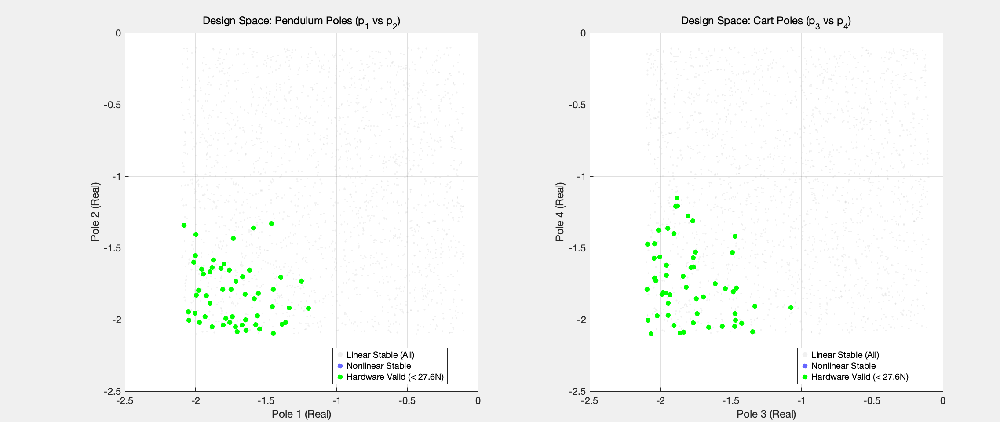

# Eigen Vector analysis

According to previous research, the MC results of the poleplacement method shows that the poles, if we want to keep the force and displacement contraint, should be keeped as follows (at 0.1 degree of initial $\theta$):

From the graph, we will test the boundary of the poles:

$$
\begin{aligned}
x_1 + x_2 &= -3 \\
x_3 + x_4 &= -3 \\
\{x_i | i = 1,2,3,4\} &\subset [-2.25, -1.25] \\
\end{aligned}
$$