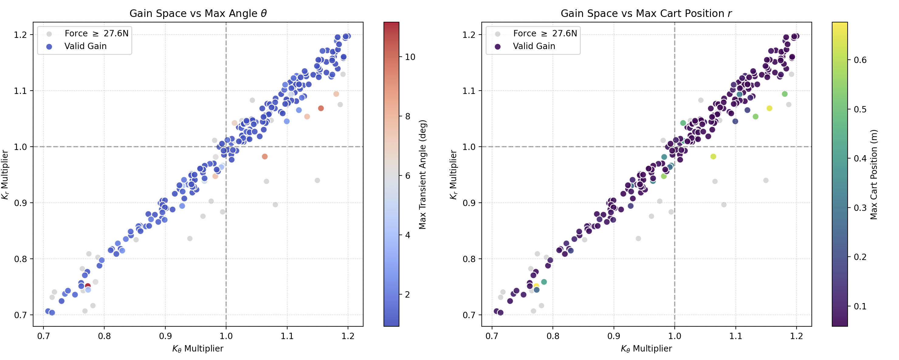
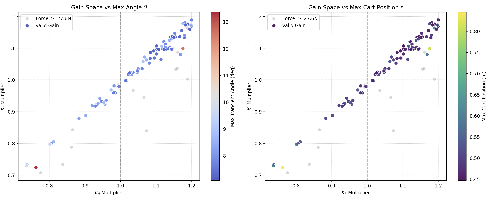
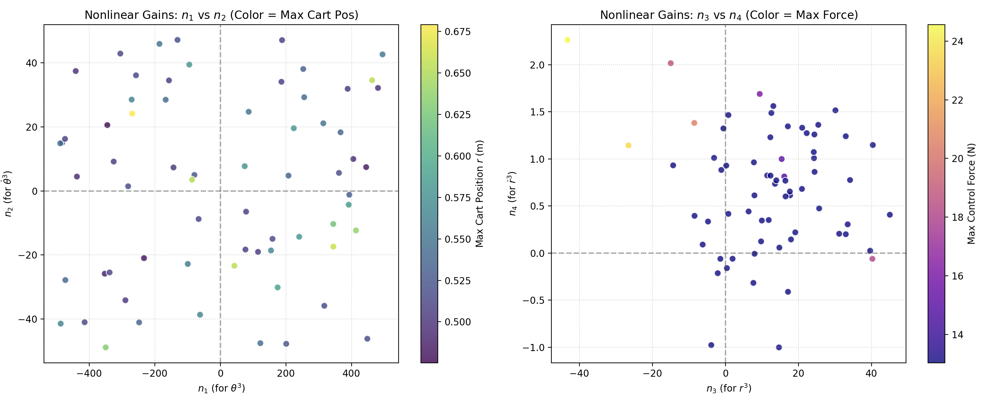
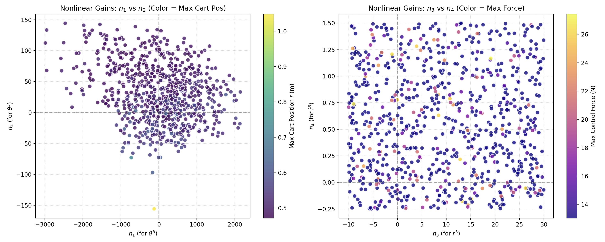
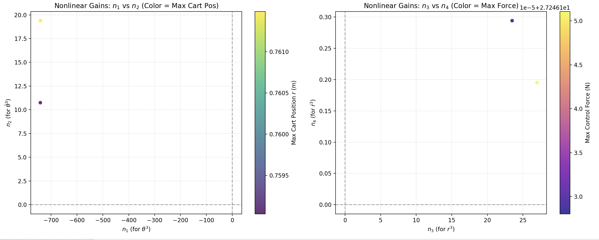
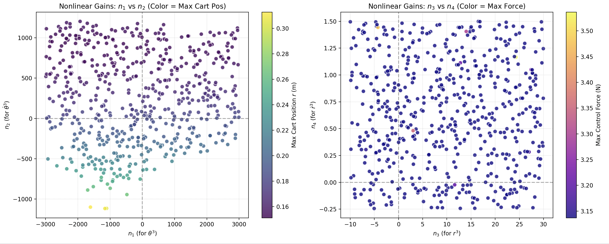

# Control of an Autonomous Unicycle

## Table of Contents

1. [Introduction and Overview](#1-introduction-and-overview)
2. [Physical Parameters](#2-physical-parameters)
3. [Mathematical Modeling](#3-mathematical-modeling) 
    - [3.1 Energy Formulations for Latitudinal Dynamics](#31-energy-formulations-for-latitudinal-dynamics) 
    - [3.2 Latitude Model Analysis with new pseudo definition](#32-latitude-model-analysis-with-new-pseudo-definition)
4. [Analysis via Monte Carlo Simulations](#4-analysis-via-monte-carlo-simulations)
    - [4.1 Color Symbology and Region Filtering](#41-color-symbology-and-region-filtering)
    - [4.2 LQR Design Space: Q1 vs Q2 and Q3 vs Q4](#42-lqr-design-space--vs--and--vs)
    - [4.3 Pole Placement Space: p1 vs p2 and p3 vs p4](#43-pole-placement-space--vs--and--vs)
    - [4.4 Direct Feedback Gain Space (K): Unveiling the Nonlinear Boundary](#44-direct-feedback-gain-space--unveiling-the-nonlinear-boundary)

## 1. Introduction and Overview
This report presents the analytical modeling, system linearization, and control law synthesis for the lateral stabilization of an autonomous unicycle. 

  
   
  <em>Figure 1: Unicycle Notation</em>

## 2. Physical Parameters

This table details the physical constants and hardware parameters used for the dynamic modeling and control  of the unicycle.

**Table 1: Unicycle Physical Parameters**

| Symbol | Parameter Description | Value | Unit |
| --- | --- | --- | --- |
| **$m_{end}$** | Mass of the object attached at the end of the rod | 0.24 | kg |
| **$m_L$** | Mass of half the rod (includes end mass) | 0.39 | kg |
| **$m_B$** | Mass of the battery | 4.10 | kg |
| **$m_W$** | Mass of the wheel | 3.50 | kg |
| **$h$** | Height offset from wheel center to body center of mass | 0.115 | m |
| **$R$** | Radius of the wheel | 0.2527 | m |
| **$g$** | Acceleration due to gravity | 9.81 | m/s² |
| **$I_b$** | Moment of inertia of the body (x-axis) | 0.0129 | kg·m² |
| **$I_w$** | Moment of inertia of the wheel (x-axis) | 0.0459 | kg·m² |
| **$I_{rod}$** | Moment of inertia of the rod | 0.0143 | kg·m² |

## 3. Mathematical Modeling

### 3.1 Energy Formulations for Latitudinal Dynamics

Given theta with a right hand rule direction:

#### _Kinetic Energy_

$$
T = m_L (\dot{r}^2 - 2R\dot{r}\dot{\theta} + R^2\dot{\theta}^2 + r^2\dot{\theta}^2) + \frac{1}{2} m_w R^2 \dot{\theta}^2 + \frac{1}{2} m_p (R + h)^2 \dot{\theta}^2
$$

#### _Potential Energy_

$$
V = m_L g (R\cos\theta + r\sin\theta) \times 2 + m_w g R \cos\theta + m_p g (R + h) \cos\theta
$$

#### _Lagrangian ($L = T - V$)_

$$
L = m_L \dot{r}^2 - 2m_L R\dot{r}\dot{\theta} + m_L R^2\dot{\theta}^2 + m_Lr^2\dot{\theta}^2  + \frac{1}{2} m_w R^2 \dot{\theta}^2 - 2m_L g R\cos\theta - 2m_L g r\sin\theta - m_w g R\cos\theta - m_p g (R + h) \cos\theta
$$

#### _Equations of Motion: $\theta$ Dynamics_

$$
\frac{d}{dt} \left( \frac{\partial L}{\partial \dot{\theta}} \right) - \frac{\partial L}{\partial \theta} = Q_{\theta}
$$

$$
\frac{\partial L}{\partial \dot{\theta}} = - 2 m_L R \dot{r} + 2 m_L R^2 \dot{\theta} + 2 m_L r^2 \dot{\theta} + m_w R^2\dot{\theta} + m_p (R + h)^2 \dot{\theta}
$$

$$
\frac{d}{dt} \left( \frac{\partial L}{\partial \dot{\theta}} \right) = - 2 m_L R \ddot{r} + 2 m_L R^2 \ddot{\theta} + 2 m_L r^2 \ddot{\theta} + 4 m_L r \dot{r} \dot{\theta} + m_w R^2 \ddot{\theta} + m_p (R + h)^2 \ddot{\theta}
$$

$$
\frac{\partial L}{\partial \theta} = 2 m_L g R \sin\theta - 2 m_L g r \cos\theta + m_w g R \sin\theta + m_p g (R + h) \sin\theta
$$

$$
Q_{\theta} = 0
$$

#### _Equations of Motion: $r$ Dynamics_

$$
\frac{d}{dt} \left( \frac{\partial L}{\partial \dot{r}} \right) - \frac{\partial L}{\partial r} = Q_r
$$

$$
\frac{\partial L}{\partial \dot{r}} = 2 m_L \dot{r} - 2 m_L R \dot{\theta}
$$

$$
\frac{d}{dt} \left( \frac{\partial L}{\partial \dot{r}} \right) = 2 m_L \ddot{r} - 2 m_L R \ddot{\theta}
$$

$$
\frac{\partial L}{\partial r} = 2 m_L r \dot{\theta}^2 - 2 m_L g \sin\theta
$$

$$
Q_{r} = F
$$

#### _Matrix Form_

$$
\begin{bmatrix} 
2m_L(R^2 + r^2) + m_w R^2 + m_p (R + h)^2 & -2m_LR \\ 
-2m_LR & 2m_L 
\end{bmatrix} 
\begin{bmatrix} 
\ddot{\theta} \\ 
\ddot{r} 
\end{bmatrix} 
= \begin{bmatrix} 
-4m_L r \dot{r} \dot{\theta} + \left( 2m_L R + m_w R + m_p (R + h) \right) g \sin\theta - 2m_L g r \cos\theta \\ 
F + 2m_L r \dot{\theta}^2 - 2m_L g \sin\theta 
\end{bmatrix}
$$

Compared to lagrange form with reverted $\theta$ direction (Without interia terms and friction):

$$
\begin{bmatrix}
2m_L R^2 + m_b(R+h)^2 + m_w R^2 + 2m_L r^2 & 2m_L R \\
2m_L R & 2m_L
\end{bmatrix}
\begin{bmatrix}
\ddot{\theta} \\
\ddot r
\end{bmatrix}
= \begin{bmatrix}
2m_L gR\sin\theta + 2m_L gr\cos\theta + m_b g(R+h)\sin\theta + m_w gR\sin\theta - 4m_L r\dot r\dot\theta \\
2m_L g\sin\theta + F + 2m_L r\dot\theta^2
\end{bmatrix}
$$

The two models will equivalent when $\theta$ direction is reverted.

And the model derived in this file is also consistent with the Appells derived in the previous file.

### 3.2 Latitude Model Analysis with new pseudo definition
Define the $E_2$ as the axis with the same $j2$ direction with the wheel. 

Center of the wheel:

$$
r_w = R \hat{j_2}
$$

Center of the rod:

$$
r_{rod} = R \hat{j_2} + r \hat{i_2}
$$

Velocity of the wheel:
$$
v_w = \dot{r}_w = - R \dot{\theta} \hat{i_2}
$$

Velocity of the pendulum:
$$
v_p = - (R + h) \dot{\theta} \hat{i_2}
$$

Velocity of the rod:
$$
v_{rod} = \dot{r}_{rod} = - R \dot{\theta} \hat{i_2} + \dot{r} \hat{i_2} + r \dot{\theta} \hat{j_2} = (- R \dot{\theta} + \dot{r}) \hat{i_2} + r \dot{\theta} \hat{j_2}
$$

Define the following pseudo velocity:

$$
u_1 = \dot{\theta} \\
u_2 = \dot{r} - R \dot{\theta} = \sigma
$$

Then we can express the velocity of the wheel and the rod in terms of the pseudo velocity:

$$
v_w = - R u_1 \hat{i_2} \\
v_{rod} = u_2 \hat{i_2} + r u_1 \hat{j_2}
$$

By Appell's method:

$$
S = \frac{1}{2} \sum_{i} m_i \mathbf{a}_i^2
$$

With equation of motion:

$$
\frac{\partial S}{\partial \ddot{q}_r} = Q_r
$$

**Accelerations:**

$$
\mathbf{a}_w = \dot{v}_w = -R \dot{u}_1 \hat{i_2} - R u_1 (u_1 \hat{j_2}) = -R \dot{u}_1 \hat{i_2} - R u_1^2 \hat{j_2}
$$

$$
\mathbf{a}_p = \dot{v}_p = - (R + h) \dot{u}_1 \hat{i_2} - (R + h) u_1 (u_1 \hat{j_2}) = - (R + h) \dot{u}_1 \hat{i_2} - (R + h) u_1^2 \hat{j_2}
$$

$$
\mathbf{a}_{rod} = \dot{v}_{rod} = \dot{u}_2 \hat{i_2} + u_2 (u_1 \hat{j_2}) + \dot{r} u_1 \hat{j_2} + r \dot{u}_1 \hat{j_2} + r u_1 (-u_1 \hat{i_2}) \\
= \dot{u}_2 \hat{i_2} + (u_2 u_1 + \dot{r} u_1 + r \dot{u}_1) \hat{j_2} - r u_1^2 \hat{i_2} \\
= (\dot{u}_2 - r u_1^2 ) \hat{i_2} + (u_2 u_1 + \dot{r} u_1 + r \dot{u}_1) \hat{j_2}
$$

**Get S:**

$$
S = \frac{1}{2} m_w |\mathbf{a}_w|^2 + \frac{1}{2} m_{rod} |\mathbf{a}_{rod}|^2 + \frac{1}{2} m_p |\mathbf{a}_p|^2 + \frac{1}{2}(I_w + I_b  + I_{rod}) \ddot{\theta}^2 \\
= \frac{1}{2} m_w (R^2 \dot{u}_1^2 + R^2 u_1^4) + \frac{1}{2} m_{rod} [(\dot{u}_2 - r u_1^2)^2 + (u_2 u_1 + \dot{r} u_1 + r \dot{u}_1)^2] \\ + \frac{1}{2} m_p ((R + h)^2 \dot{u}_1^2 + (R + h)^2 u_1^4) + \frac{1}{2}(I_w + I_b  + I_{rod}) \dot{u_1}^2
$$

**Equations of motion:**

$$
\frac{\partial S}{\partial \dot{u}_1} = Q_1 \\ 
\frac{\partial S}{\partial \dot{u}_2} = Q_2
$$

$$
\frac{\partial S}{\partial \dot{u}_1} = m_w R^2 \dot{u}_1 + m_{rod}(u_2 u_1 + \dot{r} u_1 + r \dot{u}_1) r + m_p (R + h)^2 \dot{u}_1 + (I_w + I_b  + I_{rod}) \dot{u}_1
$$

As  $\dot{r} = u_2 + R u_1$:

$$
\frac{\partial S}{\partial \dot{u}_1} = (m_w R^2 + m_p (R + h)^2 + m_{rod} r^2 + I_w + I_b  + I_{rod}) \dot{u}_1 + m_{rod} r (2 u_2 u_1 + R u_1^2)
$$

$$
\frac{\partial S}{\partial \dot{u}_2} = m_{rod} (\dot{u}_2 - r u_1^2)
$$

**Virtual work:**

$$
\delta P_F = \Sigma F_i \cdot \delta \dot{r}_i\\
= F \cdot \delta v_{rod} - F \cdot \delta v_w \\
= F \hat{i_2} \cdot (\delta u_2 \hat{i_2} + r \delta u_1 \hat{j_2}) - F \hat{i_2} \cdot (- R \delta u_1 \hat{i_2}) \\
= F \delta u_2 + F R \delta u_1
$$

$$
\delta P_G = G_{rod} \cdot \delta \dot{r}_{rod} + G_w \cdot \delta \dot{r}_w \\
= - m_{rod} g \hat{j_1} \cdot (\delta u_2 \hat{i_2} + r \delta u_1 \hat{j_2}) + (- m_w g) \hat{j_1} \cdot ( -R \delta u_1 \hat{i_2}) + (- m_p g) \hat{j_1} \cdot ( -(R + h) \delta u_1 \hat{i_2}) \\
= - m_{rod} g \sin\theta \delta u_2  - m_{rod} g r \cos\theta \delta u_1 + m_w g R \sin\theta \delta u_1 + m_p g (R + h) \sin\theta \delta u_1 \\
= - m_{rod} g \sin\theta \delta u_2 - (m_{rod} g r \cos\theta - m_w g R \sin\theta - m_p g (R + h) \sin\theta) \delta u_1
$$

**Final equations of motion:**

$$
\frac{\partial S}{\partial \dot{u}_1} = Q_1 = F R - m_{rod} g r \cos\theta + m_w g R \sin\theta + m_p g (R + h) \sin\theta \\
\frac{\partial S}{\partial \dot{u}_2} = Q_2 = F - m_{rod} g \sin\theta
$$

In matrix form:

$$
\begin{bmatrix} 
m_w R^2 + m_{rod} r^2 + m_p (R + h)^2 + (I_w + I_b  + I_{rod}) & 0 \\ 
0 & m_{rod} 
\end{bmatrix}
\begin{bmatrix} 
\dot{u}_1 \\ 
\dot{u}_2 
\end{bmatrix}
= \begin{bmatrix} 
F R - m_{rod} g r \cos\theta + m_w g R \sin\theta + m_p g (R + h) \sin\theta - m_{rod} r (2 u_2 u_1 + R u_1^2) \dot{u}_1 \\ 
F - m_{rod} g \sin\theta + m_{rod} r u_1^2 
\end{bmatrix}
$$

## 4. Analysis via Monte Carlo Simulations

To rigorously evaluate the viability of linear control strategies (LQR and Pole Placement) on the highly nonlinear unicycle system, a 4-dimensional global Monte Carlo sweep was conducted. The Monte Carlo method randomizes all four design variables simultaneously ($Q_1, Q_2, Q_3, Q_4$ for LQR; $p_1, p_2, p_3, p_4$ for Pole Placement; and $k_1, k_2, k_3, k_4$ for direct feedback gains).

The primary objective of this randomized sampling (testing thousands of configurations) is to mathematically and numerically prove whether there exists any global linear configuration capable of stabilizing an initial condition $\theta_0$ while strictly respecting the physical limitations of the FAULHABER LM2070 linear motor (Peak Force $\le 27.6\text{ N}$ and Continuous Force $\le 9.2\text{ N}$).

You will be able to take a look to this simulations in the next [link](https://github.com/gaoshenghan1130/Python_Simu4Unicycle/tree/Documentation/MATLAB/analysis).

### 4.1 Color Symbology and Region Filtering

Across all generated scatter plots, the data is strictly filtered using a three-layer validation process, represented by the following color symbology:

Gray Region (Mathematically Stable - The Linear "Illusion"): These points represent all randomly generated configurations that satisfy linear stability criteria (e.g., positive Q matrices, negative poles, or Routh-Hurwitz validated $K$ gains). According to pure linear theory, all gray points should stabilize the system.

Blue Region (Nonlinearly Stable - The Physics Filter): These are the subset of gray points that successfully survived the ode45 simulation using the full Appell dynamic model (including real trigonometry, gravity, and Coriolis forces). If a point is blue, the robot physically recovered without falling (Angle $< 27^\circ$).

Green Region (Hardware Valid - The Actuator Filter): This is the ultimate design goal. These are the subset of blue points that managed to stabilize the nonlinear physics without demanding a transient peak force greater than $27.6\text{ N}$.

(Note: The absence or statistical insignificance of Green points the actuator saturation under linear control).

### 4.2 LQR Design Space: $Q_1$ vs $Q_2$ and $Q_3$ vs $Q_4$

The LQR Monte Carlo sweep visualizes the "decision-making" priorities of the controller.

$Q_1$ vs $Q_2$: This projection shows the relationship between the angle penalty ($Q_1 \rightarrow \theta $) and the angular velocity penalty ($Q_2 \rightarrow \dot{\theta} $). 

$Q_3$ vs $Q_4$: This plots the position ($Q_3 \rightarrow r $) versus linear velocity ($Q_4 \rightarrow \dot{r} $) penalties. 

  
   
  <em>Figure 2: LQR Monte Carlo theta_0 = 0.03 degree </em>

  
   
  <em>Figure 3: LQR Monte Carlo theta_0 = 0.5 degree</em>

  
   
  <em>Figure 4: LQR Monte Carlo theta_0 = 1 degree</em>

### 4.3 Pole Placement Space: $p_1$ vs $p_2$ and $p_3$ vs $p_4$

Instead of optimizing costs, Pole Placement dictates the exact settling time and transient response.

$p_1$ vs $p_2$ (Dominant Poles): Pushing these poles further into the left half-plane (more negative) forces the pendulum to recover faster.

$p_3$ vs $p_4$ (Secondary Poles): These dictate the cart's stabilization speed.
The Monte Carlo data here confirms that achieving a settling time fast enough to "catch" the unicycle before it crosses the nonlinear point of no return inherently requires control signals that exceed the $27.6\text{ N}$ saturation threshold. It proves that the saturation is not a "tuning error" from LQR weights, but a fundamental dynamic restriction of the required system speed.

_Note: This tests were executed using random poles using this notation. This can be changed inside MC_PP_lat_4P_

 $p_{rand} = -0.1 - 20 * rand(N, 1); $ 

  
   
  <em>Figure 5: Pole Placement Monte Carlo theta_0 = 0.03 degree</em>

  
   
  <em>Figure 6: Pole Placement Monte Carlo theta_0 = 0.5 degree</em>

  
   
  <em>Figure 7: Pole Placement Monte Carlo theta_0 = 1 degree</em>

### 4.4 Direct Feedback Gain Space ($K$): Unveiling the Nonlinear Boundary

The most critical revelation of this analysis is found by directly mapping the feedback gains ($k_1, k_2, k_3, k_4$), as $K$ is the bridge between the theoretical control law ($F = -Kz$) and the physical actuator.

$k_1$ (Proportional Angle) vs $k_2$ (Derivative Angle): This projection directly confronts the classic Routh-Hurwitz (RH) stability boundaries. The RH criteria defined a massive geometric volume where the system is theoretically stable (the Gray dots). However, the Monte Carlo analysis completely shatters this assumption.
When the realistic initial condition $\theta_0$ perturbation is introduced, the Small Angle Approximation ($\sin\theta \approx \theta$) degrades, and unmodeled fictitious forces (Coriolis) emerge. The Blue Region (Nonlinear Stability) occupies only a fraction of the original RH boundary. This graphically defines the Nonlinear Boundary: it shows exactly which theoretically stable $K$ combinations trigger unbounded oscillations or immediate collapse in the real world.

$k_3$ (Proportional Position) vs $k_4$ (Derivative Position): This confirms the structural underactuation problem.

  
   
  <em>Figure 8: Ks Monte Carlo RH Stable Region</em>

  
   
  <em>Figure 9: Ks Monte Carlo theta_0 = 0.03 degree</em>

  
   
  <em>Figure 10: Ks Monte Carlo theta_0 = 0.5 degree</em>

# Further analysis on trying to add the $theta^3$ term to the controller

As we want to ease the effect of the initial condition $theta_0$ on the controller, we can try to add a $theta^3$ term to the controller. (As well as $r^3$ term). The controller will be like this:

$$
F = -k_1 \theta - k_2 \dot{\theta} - k_3 r - k_4 \dot{r} - n_1 \theta^3 - n_2 \dot{\theta}^3 - n_3 r^3 - n_4 \dot{r}^3
$$

Firstly as a verification, with initial condition ${\theta}_0 = 0.1 \degree$, and MC the k gains (235/10000 are stable and 210 are within the force limit)::

This proves that the MC and the model is working correctly. The boundary condition for the LQR gains is about $0.956 \degree$. And we can show what happens there (97/10000 are stable and 84 of them are within the force limit):

We can see that there is still some stable points, but $0.956 \degree$ is fairly small for implementation. 

After that, we can try to add the 3 order terms to the controller. At $0.956 \degree$, 66/10000 are valid:

From this plot, we can see that we could increase the range of $\theta^3$ gains, and decrease the range for $r^3$ gains:

And increasing the initial theta a bit (to $2 \degree$), we can thus prove that the $\theta^3$ term is helping to increase the stability range. At $2 \degree$, 2/1000 are valid, which should be the boundary condition:

If we take $r < 0.15m$ into consideration, the boundary for LQR will be $0.18 \degree$, and with the $\theta^3$ term, we can increase it to $0.23 \degree$.

