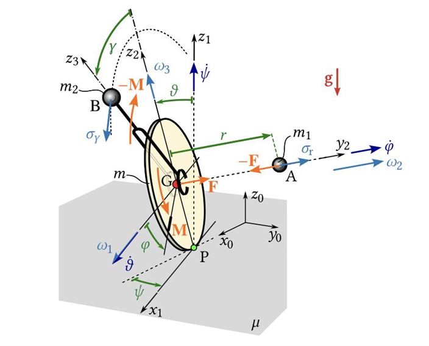
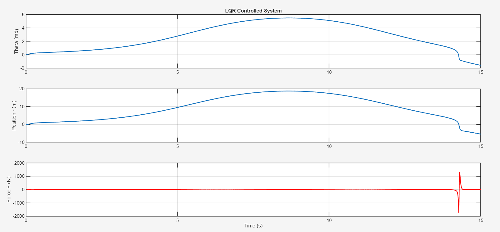

# Control of an Autonomous Unicycle

## Table of Contents

1. [Introduction and Overview](#1-introduction-and-overview)
2. [Physical Parameters](#2-physical-parameters)
3. [Mathematical Modeling (Lagrangian Mechanics)](#3-mathematical-modeling-lagrangian-mechanics) 
    - [3.1 Energy Formulations for Latitudinal Dynamics](#31-energy-formulations-for-latitudinal-dynamics) 
4. [Linearization](#4-linearization) 
    - [4.1 Linear vs. Nonlinear Model](#41-linear-vs-non-linear-model) 
5. [Control Methodologies](#5-control-methodologies) 
    - [5.1 Linear Quadratic Regulator (LQR)](#51-linear-quadratic-regulator-lqr) 
        - [5.1.1 Results](#511-results) 
    - [5.2 Pole Placement](#52-pole-placement) 
        - [5.2.1 Results](#521-results) 
    - [5.3 Model Predictive Control (MPC)](#53-model-predictive-control-mpc) 
        - [5.3.1 Results](#531-results)

## 1. Introduction and Overview
This report presents the analytical modeling, system linearization, and control law synthesis for the lateral stabilization of an autonomous unicycle. 

  
   
  <em>Figure 1: Unicycle Notation</em>

## 2. Physical Parameters

This table details the physical constants and hardware parameters used for the dynamic modeling and control  of the unicycle.

**Table 1: Unicycle Physical Parameters**

| Symbol | Parameter Description | Value | Unit |
| --- | --- | --- | --- |
| **$m_{end}$** | Mass of the object attached at the end of the rod | 0.24 | kg |
| **$m_L$** | Mass of half the rod (includes end mass) | 0.39 | kg |
| **$m_B$** | Mass of the battery | 4.10 | kg |
| **$m_W$** | Mass of the wheel | 3.50 | kg |
| **$h$** | Height offset from wheel center to body center of mass | 0.115 | m |
| **$R$** | Radius of the wheel | 0.2527 | m |
| **$g$** | Acceleration due to gravity | 9.81 | m/s² |
| **$I_b$** | Moment of inertia of the body (x-axis) | 0.0129 | kg·m² |
| **$I_w$** | Moment of inertia of the wheel (x-axis) | 0.0459 | kg·m² |
| **$I_{rod}$** | Moment of inertia of the rod | 0.0143 | kg·m² |

## 3. Mathematical Modeling (Lagrangian Mechanics)

### 3.1 Energy Formulations for Latitudinal Dynamics

#### _Kinetic Energy_

$$
T = m_L (\dot{r}^2 + 2R\dot{r}\dot{\theta} + R^2\dot{\theta}^2 + r^2\dot{\theta}^2) + \frac{1}{2} m_b (R+h)^2 \dot{\theta}^2 + \frac{1}{2} m_w R^2 \dot{\theta}^2 + \frac{1}{2} I_b \dot{\theta}^2 + \frac{1}{2} I_w \dot{\theta}^2 + \frac{1}{2} I_{rod} \dot{\theta}^2
$$

#### _Potential Energy_

$$
V = m_L g (R\cos\theta - r\sin\theta) \times 2 + m_b g (R+h)\cos\theta + m_w g R \cos\theta 
$$

#### _Lagrangian ($L = T - V$)_

$$
L = m_L \dot{r}^2 + 2m_L R\dot{r}\dot{\theta} + m_L R^2\dot{\theta}^2 + m_Lr^2\dot{\theta}^2 + \frac{1}{2} m_b (R+h)^2 \dot{\theta}^2 + \frac{1}{2} m_w R^2 \dot{\theta}^2 + \frac{1}{2} I_b \dot{\theta}^2 + \frac{1}{2} I_w \dot{\theta}^2 + \frac{1}{2} I_{rod} \dot{\theta}^2 - 2m_L g R\cos\theta + 2m_L g r\sin\theta - m_b g (R+h)\cos\theta - m_w g R\cos\theta
$$

#### _Equations of Motion: $\theta$ Dynamics_

$$
\frac{d}{dt} \left( \frac{\partial L}{\partial \dot{\theta}} \right) - \frac{\partial L}{\partial \theta} = Q_{\theta}
$$

$$
\frac{\partial L}{\partial \dot{\theta}} = 2 m_L R \dot{r} + 2 m_L R^2 \dot{\theta} + 2 m_L r^2 \dot{\theta} + m_b (R+h)^2 \dot{\theta} + m_w R^2\dot{\theta} + I_b\dot{\theta} + I_w\dot{\theta} + I_{rod} \dot{\theta}
$$

$$
\frac{d}{dt} \left( \frac{\partial L}{\partial \dot{\theta}} \right) = 2 m_L R \ddot{r} + 2 m_L R^2 \ddot{\theta} + 2 m_L r^2 \ddot{\theta} + 4 m_L r \dot{r} \dot{\theta} + m_b (R+h)^2 \ddot{\theta} + m_w R^2 \ddot{\theta} + I_b\ddot{\theta} + I_w\ddot{\theta} + I_{rod} \ddot{\theta}
$$

$$
\frac{\partial L}{\partial \theta} = 2 m_L g R \sin\theta + 2 m_L g r \cos\theta + m_b g (R+h) \sin\theta + m_w g R \sin\theta
$$

$$
Q_{\theta} = 0
$$

#### _Equations of Motion: $r$ Dynamics_

$$
\frac{d}{dt} \left( \frac{\partial L}{\partial \dot{r}} \right) - \frac{\partial L}{\partial r} = Q_r
$$

$$
\frac{\partial L}{\partial \dot{r}} = 2 m_L \dot{r} + 2 m_L R \dot{\theta}
$$

$$
\frac{d}{dt} \left( \frac{\partial L}{\partial \dot{r}} \right) = 2 m_L \ddot{r} + 2 m_L R \ddot{\theta}
$$

$$
\frac{\partial L}{\partial r} = 2 m_L r \dot{\theta}^2 + 2 m_L g \sin\theta
$$

$$
Q_{r} = F - F_r
$$

#### _Matrix Form_

$$
\begin{bmatrix}
2m_L R^2 + m_b(R+h)^2 + m_w R^2 + I_b + I_w + I_{rod} + 2m_L r^2 & 2m_L R \\
2m_L R & 2m_L
\end{bmatrix}
\begin{bmatrix}
\ddot{\theta} \\
\ddot r
\end{bmatrix}
= \begin{bmatrix}
2m_L gR\sin\theta + 2m_L gr\cos\theta + m_b g(R+h)\sin\theta + m_w gR\sin\theta - 4m_L r\dot r\dot\theta \\
2m_L g\sin\theta + F - F_r + 2m_L r\dot\theta^2
\end{bmatrix}
$$

## 4. Linearization
Content goes here...

### 4.1 Linear vs Non-Linear Model
Content goes here...

## 5. Control Methodologies
Content goes here...

### 5.1 Linear-Quadratic Regulator (LQR)

Based on the Lagrangian derivation, the state vector is defined as $z = [\theta, \dot{\theta}, r, \dot{r}]^T$.

The system equations are expressed in the standard inertial matrix form:

$$M(z) \ddot{q} = \mathbf{F}_{rhs}(z, u)$$

Where the mass matrix $M(z)$ and the force vector $\mathbf{F}_{rhs}$ are extracted directly from the system mechanics:

$$M(z) = \begin{bmatrix} 2m_L R^2 + m_B(R+h)^2 + m_W R^2 + 2m_L r^2 + I_b + I_w + I_{rod} & -2m_L R \\ -2m_L R & 2m_L \end{bmatrix}$$

$$\mathbf{F}_{rhs}(z, u) = \begin{bmatrix} 2m_L g R\sin\theta - 2m_L g r\cos\theta + m_B g(R+h)\sin\theta + m_W g R\sin\theta - 4m_L r \dot{r} \dot{\theta} \\ - 2m_L g\sin\theta + F + 2m_L r \dot{\theta}^2 \end{bmatrix}$$

#### Linearized State-Space Model

By isolating the accelerations $\ddot{q} = M(z)^{-1} \mathbf{F}_{rhs}$, the continuous-time state derivatives $\dot{z}$ are formed. To utilize LQR, the system is linearized around the upright equilibrium point $z_{eq} = [0, 0, 0, 0]^T$ and $F_{eq} = 0$.

Taking the multi-variable Jacobians yields the linear continuous-time model $\dot{z} = Az + Bu$:

$$A = \frac{\partial \dot{z}}{\partial z}\Bigg|_{z_{eq}, F_{eq}} = \begin{bmatrix} 0 & 1 & 0 & 0 \\ \frac{\partial \ddot{\theta}}{\partial \theta} & 0 & \frac{\partial \ddot{\theta}}{\partial r} & 0 \\ 0 & 0 & 0 & 1 \\ \frac{\partial \ddot{r}}{\partial \theta} & 0 & \frac{\partial \ddot{r}}{\partial r} & 0 \end{bmatrix}, \quad B = \frac{\partial \dot{z}}{\partial F}\Bigg|_{z_{eq}, F_{eq}} = \begin{bmatrix} 0 \\ \frac{\partial \ddot{\theta}}{\partial F} \\ 0 \\ \frac{\partial \ddot{r}}{\partial F} \end{bmatrix}$$

*Note: The exact numerical values for $A$ and $B$ are computed natively in MATLAB by substituting the physical parameters from Table 1 into these symbolic Jacobians.*

#### Optimal Cost Function and Weighting Matrices

The LQR algorithm calculates the optimal state-feedback control law $u = -Kz$ that minimizes the infinite-horizon quadratic cost function:

$$J = \int_{0}^{\infty} \left( z^T Q z + u^T R_w u \right) dt$$

To achieve strict lateral stabilization while avoiding motor saturation, the state penalty matrix $Q$ and the control penalty scalar $R_w$ were tuned to the following values:

$$Q = \begin{bmatrix} 1000 & 0 & 0 & 0 \\ 0 & 100 & 0 & 0 \\ 0 & 0 & 100 & 0 \\ 0 & 0 & 0 & 10 \end{bmatrix}, \quad R_w = 30$$

A high penalty ($Q_{11} = 1000$) is placed on the pitch angle $\theta$ to ensure the unicycle strictly rejects tipping. Moderate penalties ($100$) are placed on the pitch rate and rod extension position to dampen oscillations, while the actuator effort is restricted via $R_w = 30$ to prevent high-frequency chattering in the motor force.

Solving the continuous-time Algebraic Riccati Equation (CARE) with these matrices yields the optimal feedback gain matrix $K$, obtaining the following values:

**Table 3: LQR Feedback Gains**

| Symbol | State Variable | Gain Value |
| --- | --- | --- |
| **$K_{\theta}$** | Pitch Angle ($\theta$) | -781.4476 |
| **$K_{\dot{\theta}}$** | Pitch Rate ($\dot{\theta}$) | -146.7735 |
| **$K_{r}$** | Rod Extension ($r$) | 229.6972 |
| **$K_{\dot{r}}$** | Extension Rate ($\dot{r}$) | 41.4447 |

#### 5.1.1 Results

  
   
  <em>Figure 2: Behavior with LQR gains</em>

### 5.2 Pole Placement
The system moment of inertia $J_0$ is defined as follows:

$$
J_0 = 2m_L R^2 + m_b (R+h)^2 + m_w R^2 + I_b + I_w + I_{rod}
$$

Gravity coupling coefficients:
* $G_{\theta 1} = 2m_g R + m_g(R+h) + m_g R$
* $G_{r1} = 2m_g r$
* $G_{\theta 2} = 2m_g$

The system dynamics can be expressed in the form $N \ddot{q} = G q + F$, where $q = [\theta, r]^T$:

$$
N = \begin{bmatrix} 
J_0 & 2m_L R^2 \\ 
2m_L R^2 & 2m_L 
\end{bmatrix}
$$

$$
\begin{bmatrix} J_0 & 2m_L R^2 \\ 2m_L R^2 & 2m_L \end{bmatrix} \begin{bmatrix} \ddot{\theta} \\ \ddot{r} \end{bmatrix} = \begin{bmatrix} G_{\theta 1} & G_{r 1} \\ G_{\theta 2} & 0 \end{bmatrix} \begin{bmatrix} \theta \\ r \end{bmatrix} + \begin{bmatrix} 0 \\ F \end{bmatrix}
$$

Define the state vector $z = [\theta, r, \dot{\theta}, \dot{r}]^T$ and input $u = F$.

$$
\dot{z} = A z + B u
$$

Where:

$$
A = N^{-1} \begin{bmatrix} 0 & 0 & 1 & 0 \\ 0 & 0 & 0 & 1 \\ G_{\theta 1} & G_{r 1} & 0 & 0 \\ G_{\theta 2} & 0 & 0 & 0 \end{bmatrix}, \quad B = N^{-1} \begin{bmatrix} 0 \\ 0 \\ 0 \\ 1 \end{bmatrix}
$$

Through closed-loop feedback control $u = -Kz$, we place the closed-loop poles to satisfy the desired characteristic equation:

$$\det(\lambda I - (A - BK)) = 0$$

The continuing MATLAB code is in `MATLAB/analysis/PolePlacement.m`.

The result for the eigenvalues are:

$$
\lambda^4 + 0.5924 k_4 \lambda^3 - 0.06548 k_3 \lambda^3 + 0.5924 k_2 \lambda^2 - 0.06548 k_1 \lambda^2 - 26.2 \lambda^2 + 10.06 k_3 \lambda - 16.7 k_4 \lambda + 10.06 k_1 - 16.7 k_2 - 167.8 = 0
$$

To make it look better, we can rearrange the terms:

$$
\lambda^4 + (0.5924 k_4 - 0.06548 k_3) \lambda^3 + (0.5924 k_2 - 0.06548 k_1 - 26.2) \lambda^2 + (10.06 k_3 - 16.7 k_4) \lambda + (10.06 k_1 - 16.7 k_2 - 167.8) = 0
$$

#### **Characteristic Equation Analysis**

**For $k_1$ and $k_2$**

Apparently:

$$
10.06 k_1 - 16.7 k_2 - 167.8 > 0 \implies k_1 > 1.66 k_2 + 16.68
$$

From our usual assumptions that the the initial state is given by a small theta, we can get:

$$
\text{Maximum F of the motor} > k_1 \times \text{initial theta} \\
\implies k_1 < 27.6 N/ 5 \degree = 316.43 N/rad \\
\implies k_1 < 316.43 \text{ and } k_2 < (k_1 - 16.68) / 1.66 < 180.57
$$

**For More about Routh-Hurwitz criteria**

$$
a_3 = 0.5924 k_4 - 0.06548 k_3 \\
a_2 = 0.5924 k_2 - 0.06548 k_1 - 26.2 \\
a_1 = 10.06 k_3 - 16.7 k_4 \\
a_0 = 10.06 k_1 - 16.7 k_2 - 167.8
$$

We have used $a_0 > 0$ to get the constraint on $k_1$ and $k_2$. For $a_3 > 0$, we have:

$$
0.5924 k_4 - 0.06548 k_3 > 0 \implies k_4 > 0.1105 k_3
$$

For $a_2 > 0$, we have:

$$
0.5924 k_2 - 0.06548 k_1 - 26.2 > 0 \\
\implies k_2 > (0.06548 k_1 + 26.2) / 0.5924 \\
\implies k_2 > 0.1105 k_1 + 44.23
$$

For $a_1 > 0$, we have:

$$
10.06 k_3 - 16.7 k_4 > 0 \implies k_3 > 1.66 k_4
$$

This gives us the constraints on two triangular regions.

For $a_3 a_2 > a_1$, we have:

$$
(0.5924 k_4 - 0.06548 k_3)(0.5924 k_2 - 0.06548 k_1 - 26.2) > 10.06 k_3 - 16.7 k_4
$$

For $a_3 a_2 a_1 > a_1^2 + a_3^2 a_0$, we have:

$$
(0.5924 k_4 - 0.06548 k_3)(0.5924 k_2 - 0.06548 k_1 - 26.2)(10.06 k_3 - 16.7 k_4) > (10.06 k_3 - 16.7 k_4)^2 + (0.5924 k_4 - 0.06548 k_3)^2 (10.06 k_1 - 16.7 k_2 - 167.8)
$$

#### 4.2.1 Results
We can't really calculate the exact boundary, so we did a Monte Carlo sampling to find the feasible region that satisfies all the above inequalities. The result is shown below.

  
   
  <em>Figure 3: Pole Place</em>

Given that the all the point inside the region satisfies the Routh-Hurwitz criteria, we can expect that the system is stable for all the points inside the region (after linearized). So now we can plug all this into the nonlinear model to further select the parameters that can stabilize the system in the nonlinear model. 

### 5.3 Model Predictive Control (MPC)
Use the model derived with Appell:

$$
\begin{bmatrix} 
m_w R^2 + m_{rod} r^2 + m_p (R + h)^2 & 0 \\ 
0 & m_{rod} 
\end{bmatrix}
\begin{bmatrix} 
\dot{u}_1 \\ 
\dot{u}_2 
\end{bmatrix}
=\begin{bmatrix} 
F R - m_{rod} g r \cos\theta + m_w g R \sin\theta + m_p g (R + h) \sin\theta - m_{rod} r (2 u_2 u_1 + R u_1^2) \\ 
F - m_{rod} g \sin\theta + m_{rod} r u_1^2 
\end{bmatrix}
$$

Where:

$$
u_1 = \dot{\theta} \\
u_2 = \dot{r} - R \dot{\theta} = \sigma
$$

To simplify a bit:

$$
\begin{bmatrix}
m_w R^2 + m_{rod} r^2 + m_p (R + h)^2 & 0 \\
0 & m_{rod} \end{bmatrix}^{-1} = \begin{bmatrix}
\dfrac{1}{m_w R^2 + m_{rod} r^2 + m_p (R + h)^2} & 0 \\
0 & \dfrac{1}{m_{rod}}
\end{bmatrix} \\
\implies \\
\begin{bmatrix} 
\dot{u}_1 \\ 
\dot{u}_2 
\end{bmatrix}
= \begin{bmatrix}
\dfrac{1}{m_w R^2 + m_{rod} r^2 + m_p (R + h)^2} & 0 \\
0 & \dfrac{1}{m_{rod}}
\end{bmatrix} \begin{bmatrix} - m_{rod} g r \cos\theta + m_w g R \sin\theta + m_p g (R + h) \sin\theta - m_{rod} r (2 u_2 u_1 + R u_1^2) \\ - m_{rod} g \sin\theta + m_{rod} r u_1^2 
\end{bmatrix} + \begin{bmatrix} FR \\
F
\end{bmatrix}
$$

Further, let $x = [\theta, r - R\theta, \dot{\theta}, \dot{r} - R\dot{\theta}]$, and $I(x_2) = m_w R^2 + m_p (R + h)^2 + m_{rod} (x_2+Rx_1)^2$:

$$\begin{aligned}
\dot{x}_1 &= x_3 \\
\dot{x}_2 &= x_4 \\
\dot{x}_3 &= \frac{1}{I(x_1, x_2)} \Big[ - m_{rod} g (x_2 + R x_1) \cos x_1 + m_w g R \sin x_1 + m_p g (R + h) \sin x_1 - m_{rod} (x_2 + R x_1) (2 x_4 x_3 + R x_3^2) + F R \Big] \\
\dot{x}_4 &= \frac{1}{m_{rod}} \Big[ - m_{rod} g \sin x_1 + m_{rod} (x_2 + R x_1) x_3^2 + F \Big]
\end{aligned}
$$

Define $\mathcal{N} = - m_{rod} g (x_2 + Rx_1) \cos x_1 + m_w g R \sin x_1 + m_p g (R + h) \sin x_1 - m_{rod} (x_2 + R x_1) (2 x_4 x_3 + R x_3^2)$

$$
\begin{aligned}
\dot{x}_1 &= x_3 \\
\dot{x}_2 &= x_4 \\
\dot{x}_3 &= \dfrac{\mathcal{N}}{I(x_2)} + \dfrac{R}{I(x_2)} F \\
\dot{x}_4 &= \frac{1}{m_{rod}} \Big[ - m_{rod} g \sin x_1 + m_{rod} (x_2 + Rx_1) x_3^2 + F \Big]
\end{aligned}
$$

Formal MPC use $\mathbf{x}_{k+1} = \mathbf{A} \mathbf{x}_k + \mathbf{B} \mathbf{u}_k + \mathbf{d}$  

$$
\mathbf{B}_c = \frac{\partial \dot{\mathbf{x}}}{\partial F} = \begin{bmatrix} 0 \\ 0 \\ \dfrac{R}{I(x_2)} \\ \dfrac{1}{m_{rod}} \end{bmatrix}
$$

$$
\mathbf{A}_c = \frac{\partial \dot{\mathbf{x}}}{\partial \mathbf{x}} = \begin{bmatrix} 
0 & 0 & 1 & 0 \\ 
0 & 0 & 0 & 1 \\ 
\dfrac{\partial \dot{x}_3}{\partial x_1} & \dfrac{\partial \dot{x}_3}{\partial x_2} & \dfrac{\partial \dot{x}_3}{\partial x_3} & \dfrac{\partial \dot{x}_3}{\partial x_4} \\ 
\dfrac{\partial \dot{x}_4}{\partial x_1} & \dfrac{\partial \dot{x}_4}{\partial x_2} & \dfrac{\partial \dot{x}_4}{\partial x_3} & 0 
\end{bmatrix}
$$

We can solve $A_c$ with MATLAB (`analysis/MPC.m`), and get (The matrix is too large so online platform may not be able to render it, please check the MATLAB code for details):

$$
\left(\begin{bmatrix}{cccc} 0 & 0 & 1 & 0\\
 0 & 0 & 0 & 1\\ 
 \frac{g\,m_{\mathrm{rod}}\,\sin\left(x_{1}\right)\,\left(x_{2}+R\,x_{1}\right)+g\,m_{b}\,\cos\left(x_{1}\right)\,\left(R+h\right)-R\,g\,m_{\mathrm{rod}}\,\cos\left(x_{1}\right)+R\,g\,m_{w}\,\cos\left(x_{1}\right)-R\,m_{\mathrm{rod}}\,x_{3}\,\left(2\,x_{4}+R\,x_{3}\right)}{I_{b}+I_{\mathrm{rod}}+I_{w}+m_{\mathrm{rod}}\,{\left(x_{2}+R\,x_{1}\right)}^2+m_{b}\,{\left(R+h\right)}^2+R^2\,m_{w}}-\frac{2\,R\,m_{\mathrm{rod}}\,\left(x_{2}+R\,x_{1}\right)\,\left(F\,R-g\,m_{\mathrm{rod}}\,\cos\left(x_{1}\right)\,\left(x_{2}+R\,x_{1}\right)+g\,m_{b}\,\sin\left(x_{1}\right)\,\left(R+h\right)+R\,g\,m_{w}\,\sin\left(x_{1}\right)-m_{\mathrm{rod}}\,x_{3}\,\left(x_{2}+R\,x_{1}\right)\,\left(2\,x_{4}+R\,x_{3}\right)\right)}{{\left(I_{b}+I_{\mathrm{rod}}+I_{w}+m_{\mathrm{rod}}\,{\left(x_{2}+R\,x_{1}\right)}^2+m_{b}\,{\left(R+h\right)}^2+R^2\,m_{w}\right)}^2} & -\frac{m_{\mathrm{rod}}\,\left(R\,{x_{3}}^2+2\,x_{4}\,x_{3}+g\,\cos\left(x_{1}\right)\right)}{I_{b}+I_{\mathrm{rod}}+I_{w}+m_{\mathrm{rod}}\,{\left(x_{2}+R\,x_{1}\right)}^2+m_{b}\,{\left(R+h\right)}^2+R^2\,m_{w}}-\frac{m_{\mathrm{rod}}\,\left(2\,x_{2}+2\,R\,x_{1}\right)\,\left(F\,R-g\,m_{\mathrm{rod}}\,\cos\left(x_{1}\right)\,\left(x_{2}+R\,x_{1}\right)+g\,m_{b}\,\sin\left(x_{1}\right)\,\left(R+h\right)+R\,g\,m_{w}\,\sin\left(x_{1}\right)-m_{\mathrm{rod}}\,x_{3}\,\left(x_{2}+R\,x_{1}\right)\,\left(2\,x_{4}+R\,x_{3}\right)\right)}{{\left(I_{b}+I_{\mathrm{rod}}+I_{w}+m_{\mathrm{rod}}\,{\left(x_{2}+R\,x_{1}\right)}^2+m_{b}\,{\left(R+h\right)}^2+R^2\,m_{w}\right)}^2} & -\frac{m_{\mathrm{rod}}\,\left(x_{2}+R\,x_{1}\right)\,\left(2\,x_{4}+2\,R\,x_{3}\right)}{I_{b}+I_{\mathrm{rod}}+I_{w}+m_{\mathrm{rod}}\,{\left(x_{2}+R\,x_{1}\right)}^2+m_{b}\,{\left(R+h\right)}^2+R^2\,m_{w}} & -\frac{2\,m_{\mathrm{rod}}\,x_{3}\,\left(x_{2}+R\,x_{1}\right)}{I_{b}+I_{\mathrm{rod}}+I_{w}+m_{\mathrm{rod}}\,{\left(x_{2}+R\,x_{1}\right)}^2+m_{b}\,{\left(R+h\right)}^2+R^2\,m_{w}}\\
  R\,{x_{3}}^2-g\,\cos\left(x_{1}\right) & {x_{3}}^2 & 2\,x_{3}\,\left(x_{2}+R\,x_{1}\right) & 0 \end{bmatrix}\right)
$$

To eliminate the 0 order error, calculate current state vector 

$$
\mathbf{d}_c = \dot{\mathbf{x}}\big|_{(\mathbf{x}_k, F_{k-1})} - \mathbf{A}_c \mathbf{x}_k - \mathbf{B}_c F_{k-1}
$$

Finally we get:

$$
\mathbf{x}_{k+1} = \mathbf{A} \mathbf{x}_k + \mathbf{B} u_k + \mathbf{d}
$$

Where $\mathbf{A} = \mathbf{I}_{4 \times 4} + \mathbf{A}_c \cdot \Delta t$, $\mathbf{B} = \mathbf{B}_c \cdot \Delta t$, $\mathbf{d} = \mathbf{d}_c \cdot \Delta t$

#### **Methods of Extending along Time Horizon**

Given

$$
\mathbf{X}_k = \begin{bmatrix} \mathbf{x}_{k+1} \\ \mathbf{x}_{k+2} \\ \vdots \\ \mathbf{x}_{k+N} \end{bmatrix}_{4N \times 1}, \quad \mathbf{U}_k = \begin{bmatrix} u_k \\ u_{k+1} \\ \vdots \\ u_{k+N-1} \end{bmatrix}_{N \times 1}
$$

We can just calculate the following equation to get the state of all time

$$
\mathbf{X}_k = \mathbf{M} \mathbf{x}_k + \mathbf{C} \mathbf{U}_k + \mathbf{D}
$$

Where:

$$
\mathbf{M} = \begin{bmatrix} \mathbf{A} \\ \mathbf{A}^2 \\ \vdots \\ \mathbf{A}^N \end{bmatrix}, \quad 
\mathbf{C} = \begin{bmatrix} 
\mathbf{B} & 0 & \dots & 0 \\ 
\mathbf{A}\mathbf{B} & \mathbf{B} & \dots & 0 \\ 
\vdots & \vdots & \ddots & \vdots \\ 
\mathbf{A}^{N-1}\mathbf{B} & \mathbf{A}^{N-2}\mathbf{B} & \dots & \mathbf{B} 
\end{bmatrix}, \quad 
\mathbf{D} = \begin{bmatrix} \mathbf{d} \\ \mathbf{A}\mathbf{d} + \mathbf{d} \\ \vdots \\ \sum_{i=0}^{N-1} \mathbf{A}^i \mathbf{d} \end{bmatrix}
$$

Define a cost function:

$$J = (\mathbf{X}_k - \mathbf{\mathcal{X}}_{ref})^T \mathbf{\bar{Q}} (\mathbf{X}_k - \mathbf{\mathcal{X}}_{ref}) + \mathbf{U}_k^T \mathbf{\bar{R}} \mathbf{U}_k
$$

Where 

$$
\mathbf{\bar{Q}} = \text{diag}(\mathbf{Q}, \dots, \mathbf{Q}_f)，\mathbf{\bar{R}} = \text{diag}(R_u, \dots, R_u)，\mathbf{\mathcal{X}}_{ref} = [\mathbf{x}_{ref}^T, \dots, \mathbf{x}_{ref}^T]^T
$$

Plugging $J$ into $\mathbf{X}_k = \mathbf{M} \mathbf{x}_k + \mathbf{C} \mathbf{U}_k + \mathbf{D}$, we can get the regressed form with constants eliminated

$$
\begin{aligned}
\min_{\mathbf{U}_k} \quad & \frac{1}{2} \mathbf{U}_k^T \mathbf{H} \mathbf{U}_k + \mathbf{G}^T \mathbf{U}_k \\
\text{s.t.} \quad & \mathbf{U}_{min} \le \mathbf{U}_k \le \mathbf{U}_{max}
\end{aligned}
$$

Where

$$
\mathbf{H} = 2 \left( \mathbf{C}^T \mathbf{\bar{Q}} \mathbf{C} + \mathbf{\bar{R}} \right) \\
\mathbf{G} = 2 \mathbf{C}^T \mathbf{\bar{Q}} \left( \mathbf{M}\mathbf{x}_k + \mathbf{D} - \mathbf{\mathcal{X}}_{ref} \right)
$$

Finally we can call `solve_qp` for this.

#### 5.3.1 Results