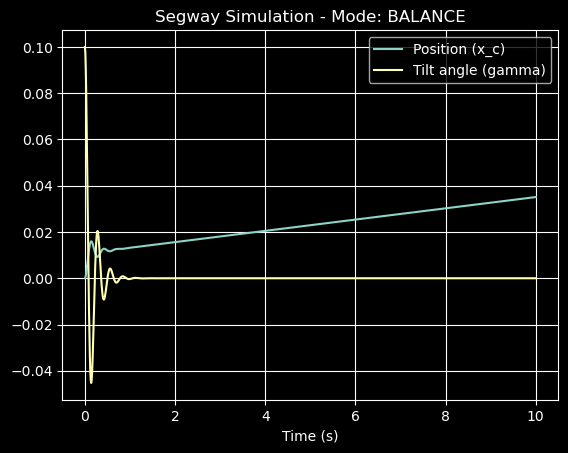
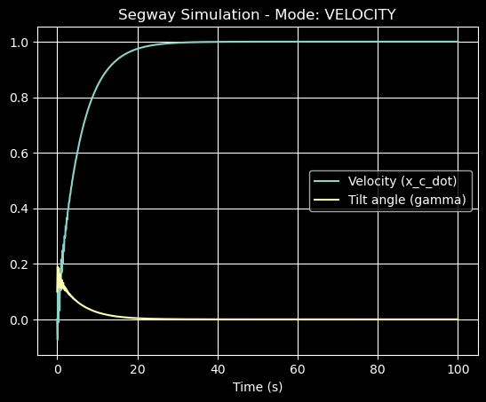
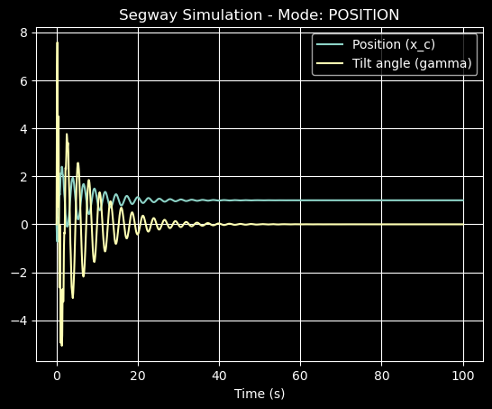

# Matlab_Simu4Unicycle

This respository provides a model for the control equations of a unicycle.

# Environment

Please refer to the `environment.yml` file for the required Python environment. You can create this environment using conda with the following command(if you clone this repository):

```bash
conda env create -f Setup/environment.yml
```

## Derivations

### Segway

[Segway Details](Derivation/Segway/Segway.ipynb)

The following is the results of the modeling for Segway:

- Balance mode:



- Velocity mode:


- Position mode:
