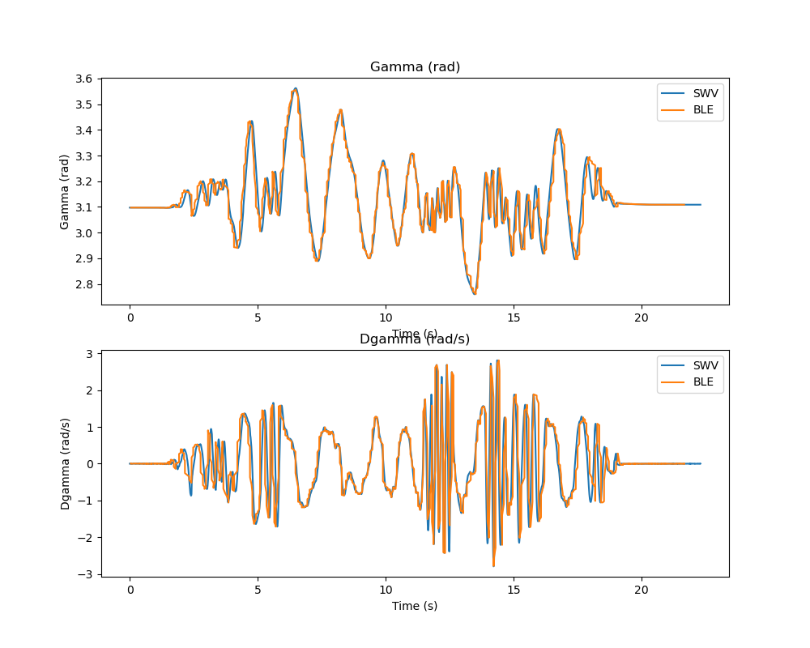
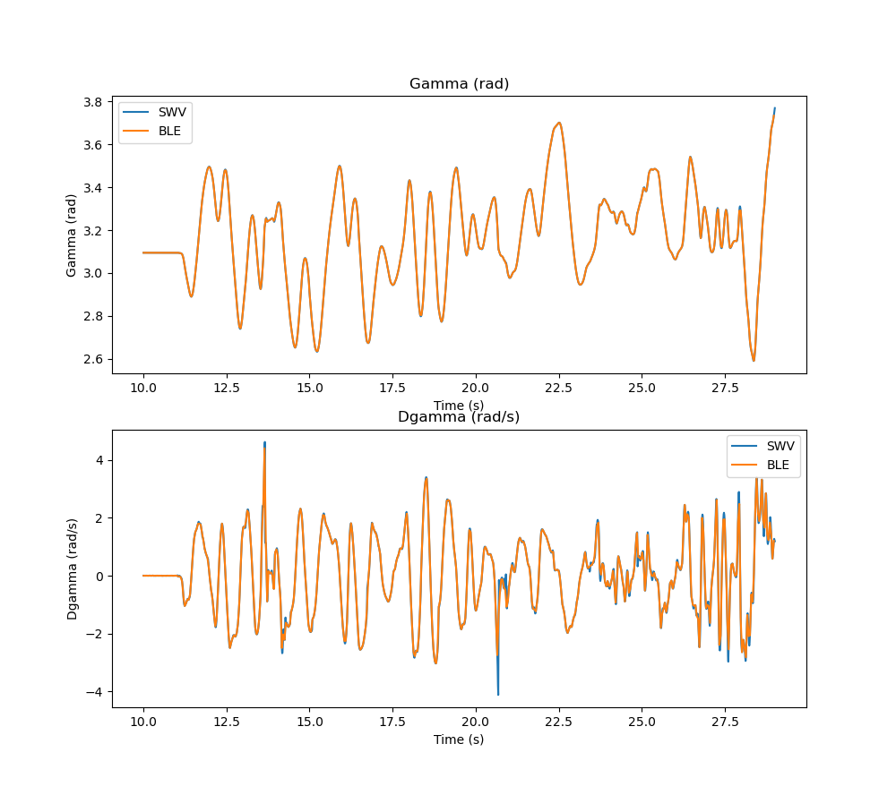

# IMU analysis - BLE optimization

I previously observed periodic data loss and non-smooth data curves, which I initially attributed to BLE buffer overflows. To address this, my initial plan was to increase the buffer size and decrease the BLE transmission frequency.However, after checking the output time step carefully, I need to make a correction: my previous deduction of a $30\text{ ms}$ BLE connection interval was incorrect. Instead, the data exhibits a $~80\text{ ms}$ cyclic burst pattern. Data is not being lost continuously; rather, it accumulates in the buffer and flushes all at once every $80\text{ ms} \sim 100\text{ ms}$. This congestion at the PC-side receiving end creates the illusion of a transmission bottleneck.

- Before optimization:

- After optimization:

The optimization was achieved by implementing a timestamping mechanism on the STM32 side (recording the midpoint time of IMU measurement), allowing the PC to accurately align incoming data with its corresponding timestamps. This way, even if data arrives in bursts, the PC can reconstruct the timeline correctly, resulting in smoother plots and more accurate analysis.

Also I decreased the transmission frequency to 25 Hz, which is sufficient for data analysis as human eye cannot really distinguish between 25 Hz and 100 Hz after plotting, as you can see from the above graph after optimization.