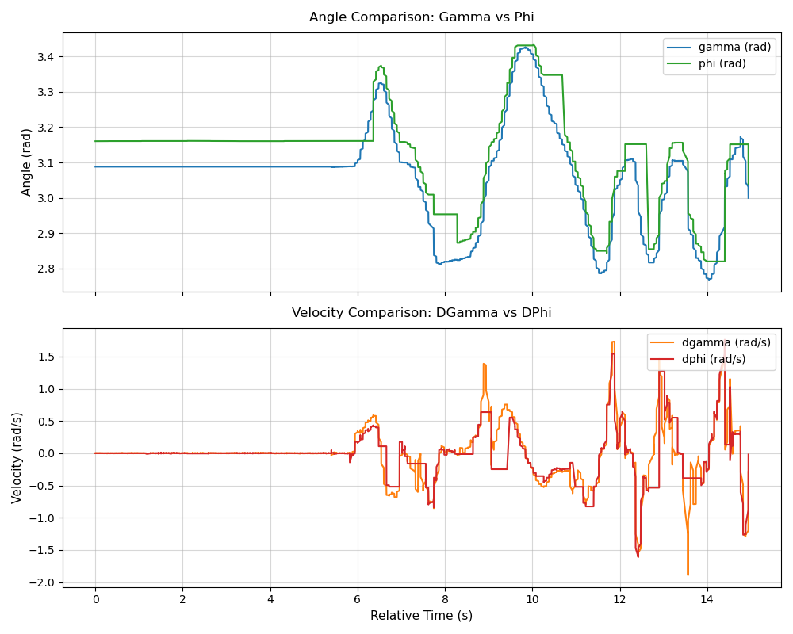

# IMU function analysis - BLE buffer overflow

As a reference, I used without changing the system (10ms update for both angle and angular velocity, BLE logging enabled, and both two IMUs are used), the data output graph looks like this:

Then I disabled the BLE logging (by commenting the entire BLE init, update and printf redirection, which should functionally disable everything related to BLE), and the data output graph looks like this:

It's pretty obvious that the data output is much more smoother than the previous one, which indicate that BLE didn't really have the capacity to log data each frame precisely. As a result I will stick to the SWV logging for all other experiments (and it's also more convenient).

Bad news is that the constant measurement values are still present, and equally bad (juding from bare eyes, with the averahe length of the constant value segments), so BLE buffer overflow is not the main reason for the bad data output.

This reveals an issue of BLE buffer, which indicated that previous analysis done by Yang and I might have some problems. So I went back to check the policy of dropping data:

In BLE application level, I code it to update each loop the data for Gamma, dgamma, phi etc, encode them into binary and send them through BLE with notify (without handshakes) to PC (in ble_interface.c). For each loop, there will be 20 bytes of data to send. If the data is not sent out in this loop, the application layer buffer will be reset and that data will be lost. There could also be some buffer in lower level, but those accumulation of data will function as a delay of starting this process, so it won't affect the calculation. 

According to Microsoft [Bluetooth Accessory Guidelines](https://learn.microsoft.com/en-us/windows-hardware/design/accessory-guidelines/bluetooth-accessory-guidelines/bluetooth-accessory-guidelines-pairing-bonding-connecting)

>All LE and dual mode accessories should operate at a connection interval that is a multiple of 7.5 ms, preferably using powers of two (e.g., 7.5ms, 15ms, 30ms, 60ms, etc.). This minimizes scheduling conflicts between piconets. Only low latency accessories like high-precision mice may use connection intervals as low as 7.5 ms. Input accessories such as keyboards should use connection intervals of 15 ms or higher. Other accessories should use 30 ms or more.

I hypothesize that the STM32 is communicating with the PC using a default BLE connection interval of 30 ms. Since our system is not registered as a low-latency input accessory (like an gaming mouse), Windows restricts its polling rate. Even though BLE 'Notifications' are theoretically unidirectional and non-blocking, the physical Link Layer still requires hardware-level packet synchronization. This limits the data flow to a 30 ms cycle, backing up our 100 Hz (10 ms) data stream, losing 2/3 of the data and making the live plot look choppy.

Another critical factor I just realized is the timing source: the PC currently timestamps the telemetry upon receipt instead of using the STM32's internal timer. While IMU readout latency via I2C jitters side, we can't really tell exactly when the data is gained even on the on the microcontroller side, the current BLE structure could work somehow. However, if later we want to fix the BLE overflow issue, we also need to implement a timestamping mechanism on the STM32 side, may be take a guess like the time of the middle of the IMU latency? This will be a bit tricky but I think it's doable.