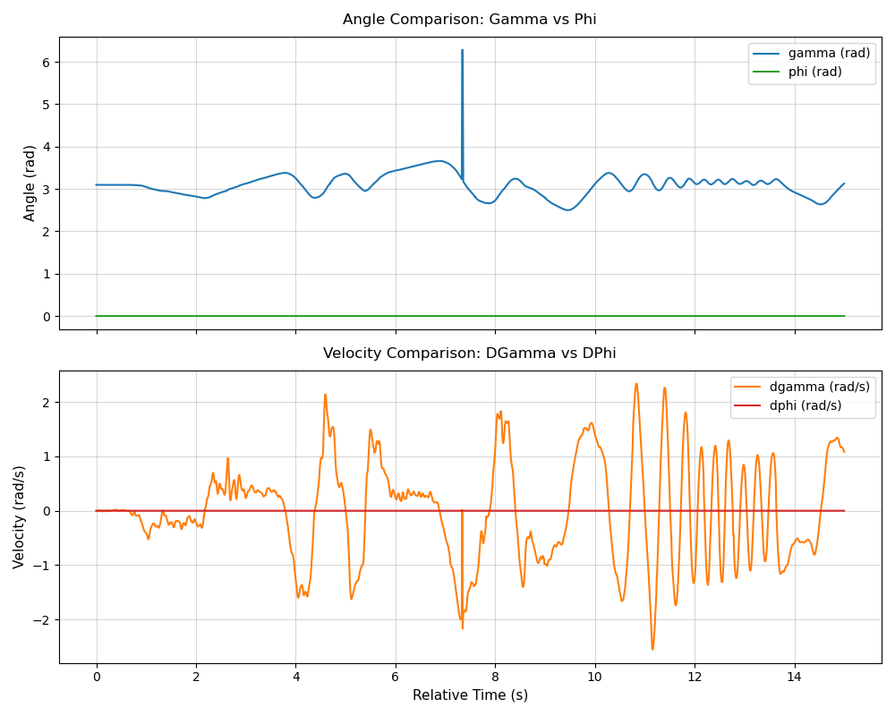
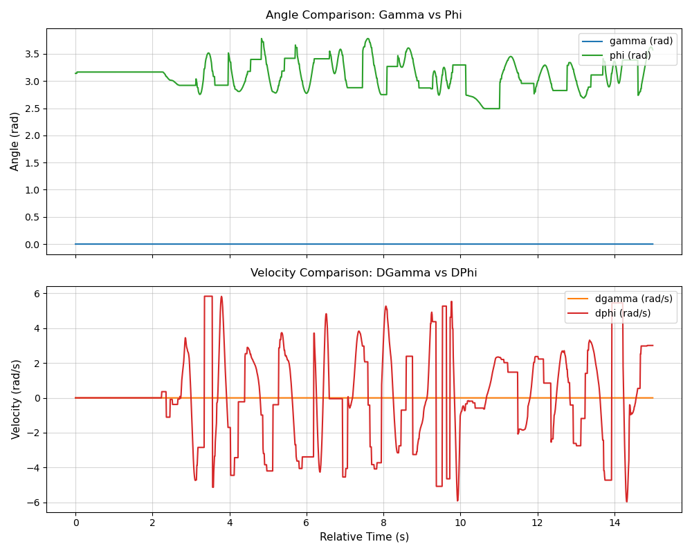

# IMU function analysis - I2C ports racing

This file deals with doubts about where the two I2C ports will interfere with each other.

For reference, when both IMU are used:

WHen disabling BNO085:

When disabling BNO055:

Constant value still persists. So this doesn't seem to be an issue.