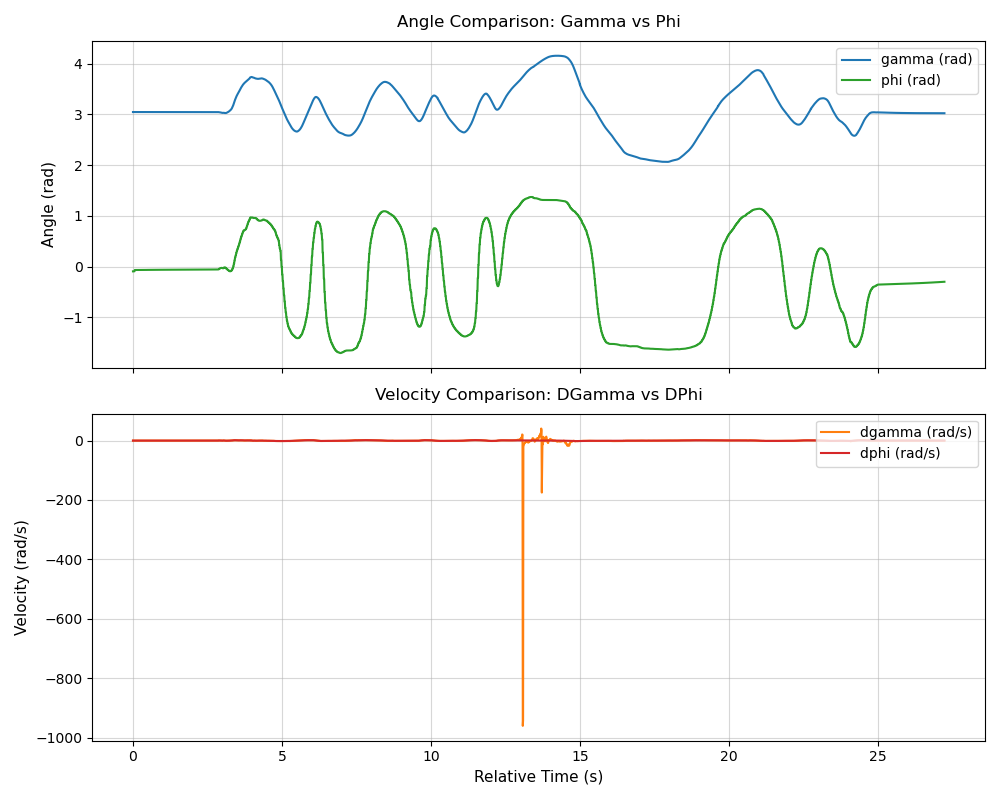
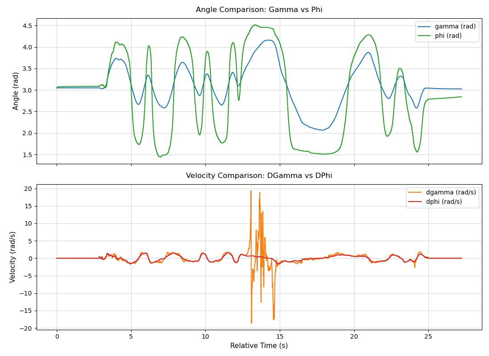

# IMU analysis - Official BNO085 Library Evaluation

After switching to the official BNO085 library, we observed a significant improvement in the data output quality. The periodic data freezes and jagged curves previously experienced with the third-party library have been mitigated. As shown in the following graph (BNO055 for Gamma and BNO085 for phi):

There's an about PI shift difference between the two chip's angle, and the BNO055‘s output of gamma needs to be filtered for some of the extreme values. To make it look better, I restricted dgamma to be within [-20, 20] rad/s, add PI to the phi output of BNO085, and get the following graph:

