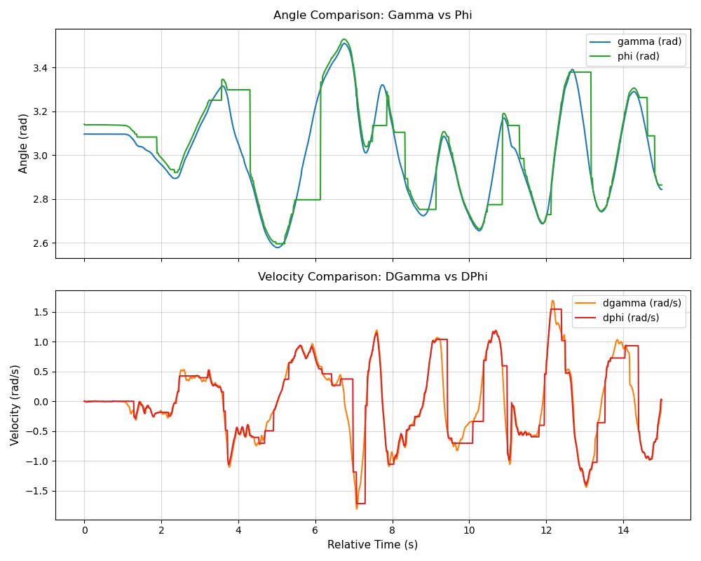
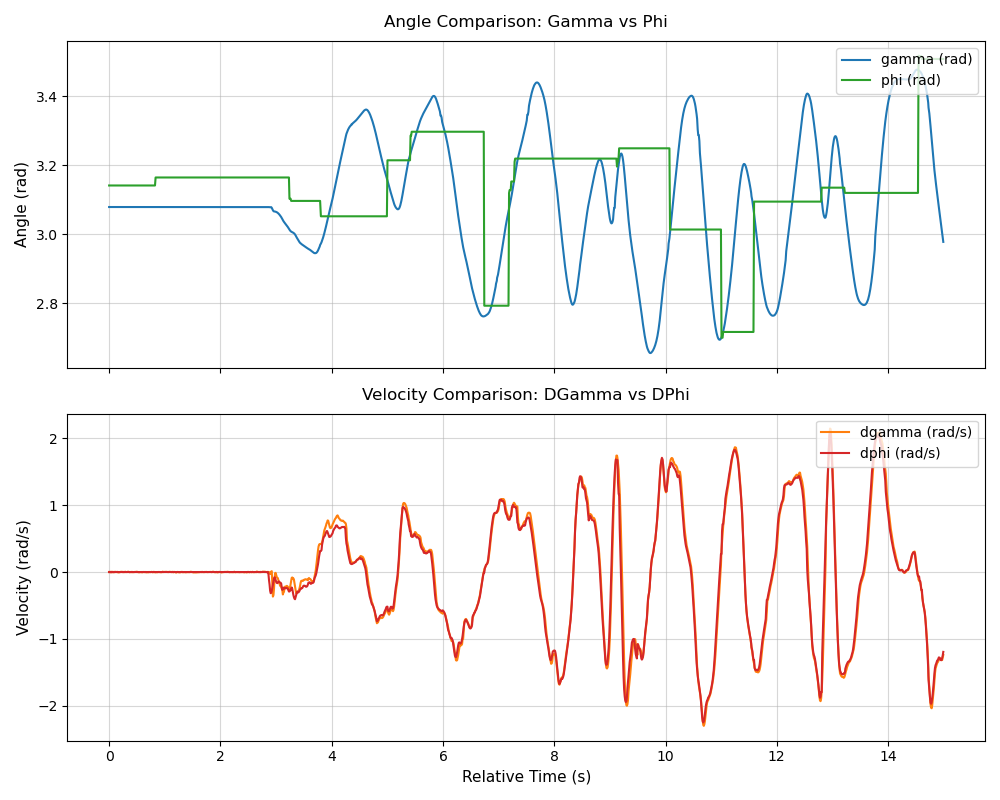

# IMU analysis - Rotation Vector mode VS Game Rotation Vector mode

There is two modes of output for angle in BNO085. According to the datasheet, the Game Rotation Vector mode is  smoother and do not need magnetometer. However I still want to check the data output of these two modes to see if there is any difference.

- For Game Rotation Vector mode, the output is as follows:

- For Rotation Vector mode, the output is as follows:

This shows that the two mode doesn't have much difference in the data output, and both of them have the constant value issue.